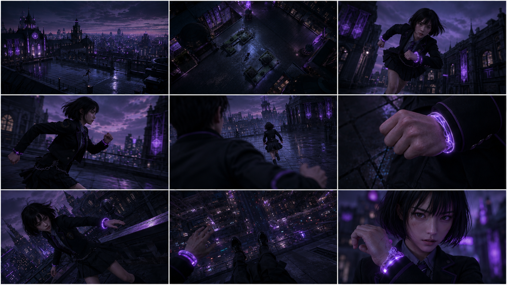
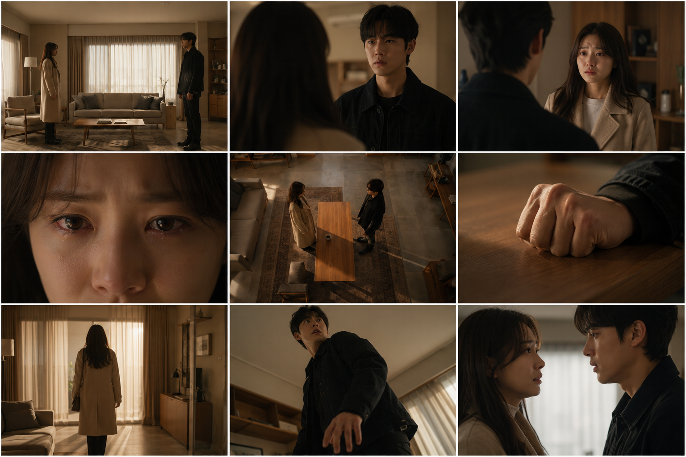
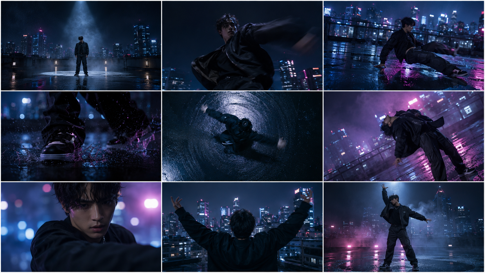
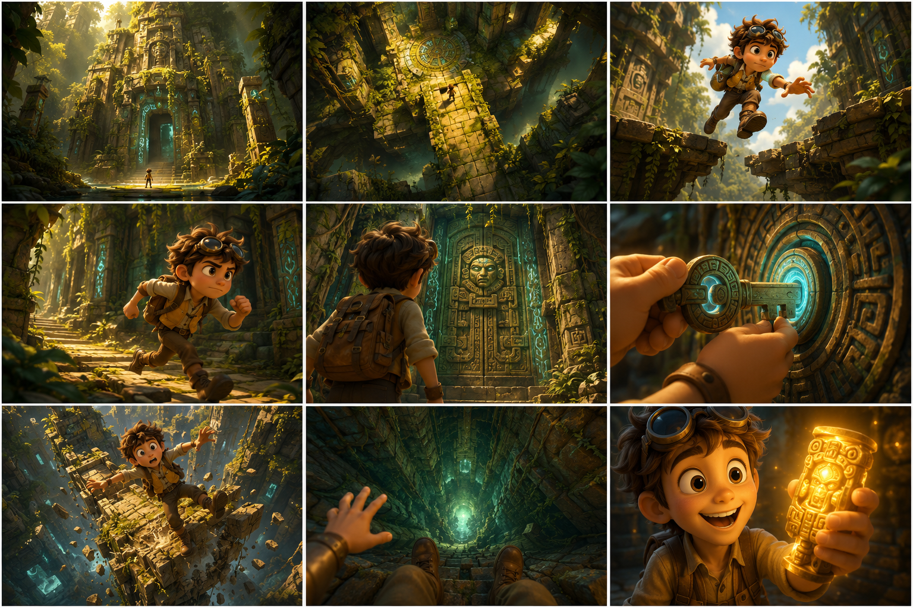
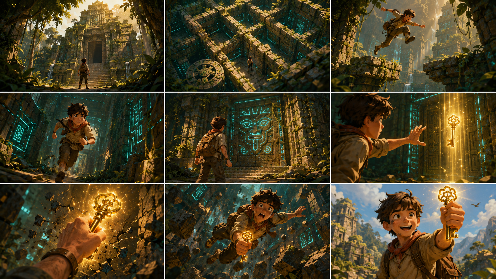

# 3x3 그리드 영상 제작 프롬프트 v1
> 작성일: 2026-07-14 | 작성자: 이슬기 (PM)
> 대상: 영상 생성(A002~A005) 파이프라인 테스트용 — 3x3 스토리보드 그리드 이미지 + Seedance 2.0 Shot 스크립트
> 기준 문서: [[2026-07-10_프롬프트가이드_v4]] 4장(영상 프롬프트 작성 원칙)을 그대로 따름 — 본 문서는 그 원칙을 실제 4개 세트에 적용한 결과물이며, 기존 가이드 문서는 수정하지 않았다.
> 참고: `framewave-docs` 통합본 [`2026-07-06_A2팀_최종_프롬프트_가이드`](https://github.com/framewave-labs/framewave-docs/tree/main/content/00_%ED%86%B5%ED%95%A9%EB%AC%B8%EC%84%9C) v2.2, 특히 5절(영상 프롬프트 구조).

---

## 0. 배경

원래는 3x3 스토리보드 그리드 이미지를 B팀 산출물로 받아 영상 생성 파이프라인을 테스트할 계획이었으나, B팀이 독립적으로 작업 중이라 실물을 받기 어려운 상황이다. 그래서 A2팀 자체적으로 GPT Image 2로 그리드 이미지를 생성하고, 여기에 짝을 맞춘 Seedance 2.0 Shot 스크립트를 작성해 파이프라인 전체(그리드 이미지 → Kling 3.0 테스트 → Seedance 2.0 최종 품질)를 검증한다.

> **주의 (통합본 v2.1 히스토리 메모 참고):** "3x3 그리드 이미지 1장" 입력 방식 자체가 아직 팀 차원에서 완전히 확정된 게 아니다(B서비스가 실제로 그리드 1장을 주는지, Seedance가 다중 이미지 입력 모델을 쓰는지는 계속 확인 중). 아래 세트는 현재 가정(그리드 1장 입력)을 기준으로 만들었고, 입력 구조가 바뀌면 재작업이 필요하다.

**용도**: Kling 3.0으로 우선 슬라이싱·프레임 순서·모션 반영도를 빠르게 확인하고, 최종 품질은 Seedance 2.0으로 검증한다. **최종 시연 퀄리티의 기준은 항상 Seedance 2.0 결과다.**

---

## 목차
1. [그리드 이미지 프롬프트 작성 시 주의점](#1-그리드-이미지-프롬프트-작성-시-주의점)
2. [세트 ① — 액션/추격 (애니메이션 스타일)](#2-세트-1--액션추격-애니메이션-스타일)
3. [세트 ② — 감정 대화 (실사 드라마 스타일)](#3-세트-2--감정-대화-실사-드라마-스타일)
4. [세트 ③ — 댄스 퍼포먼스 (실사 뮤직비디오 스타일)](#4-세트-3--댄스-퍼포먼스-실사-뮤직비디오-스타일)
5. [세트 ④ — Pixar 3D 스타일 정글 탐험](#5-세트-4--pixar-3d-스타일-정글-탐험)
6. [활용 순서 권장](#6-활용-순서-권장)

---

## 1. 그리드 이미지 프롬프트 작성 시 주의점

실전 테스트에서 발견한 이슈와 해결책이다.

| 이슈 | 원인 | 해결 |
|---|---|---|
| 그리드에 1~9 숫자가 실제로 렌더링됨 | 프롬프트 안에 "Panel 1", "Panel 2"... 처럼 숫자 토큰이 반복 등장하면, "no numbers" 지시가 있어도 모델이 그 숫자를 화면에 그려버림 | "Panel N" 대신 **위치 기반 표기**(top-left / top-center / top-right / middle-left / center / middle-right / bottom-left / bottom-center / bottom-right)만 사용 — 숫자 토큰 자체를 프롬프트에서 없앤다 |
| 공통 배경 지시와 개별 패널 지시가 충돌 | 예: 배경에 "No characters appear in any panel"라고 써놓고 특정 패널에 인물을 등장시키면 모델이 개별 지시를 우선 따름 | 공통 배경 설명과 각 패널 설명이 서로 모순되지 않는지 작성 후 재검토 |
| 특정 패널에만 소품이 갑자기 등장 | 공통 배경 라인에 없는 소품(예: 의자)을 개별 패널에서만 언급하면 연속성이 깨짐 | 소품은 공통 배경 라인에 미리 선언하거나, 개별 패널에서는 아예 언급하지 않기 |

**영상 Shot 프롬프트는 그리드 이미지의 9패널 순서·카메라앵글과 1:1 매칭되도록 작성한다** — 그리드 이미지가 "그림"이면 Shot 스크립트는 그 그림에 "움직임과 소리"를 입히는 구조다. 아래 4세트 모두 [[2026-07-10_프롬프트가이드_v4]] 4.2절 표준 형식(Style/Duration 헤더 + Shot N + 타임코드 + Scene/Action/Sound)을 따르고, 카메라 무브먼트는 샷당 1개로 제한, 사운드는 매 샷 최소 1개 구체적으로 명시했다.

---

## 2. 세트 ① — 액션/추격 (애니메이션 스타일)

**그리드 이미지 프롬프트 (GPT Image 2)**

```
A single image containing a 3x3 grid layout of 9 storyboard panels, thin white borders separating panels. The panels form one continuous story sequence read left to right, then top to bottom — the top-left panel is the story's opening moment, the bottom-right panel is its closing moment, with the narrative unfolding progressively across the grid. The image contains absolutely no numbers, digits, readable text, or logos anywhere — the panels are visually silent, distinguished only by their content and camera framing.

Background first: consistent rooftop of a city fantasy school at dusk, purple neon skyline in the distance, urban fantasy Korean drama, anime style, dominant black #1E1E24 and vibrant purple #7B61FF accents across all 9 panels.

Character: 미라 한, a young woman with a black bob haircut, dark academy uniform, glowing purple bracelet on her wrist. Her face shape, hairstyle, and outfit must remain extremely consistent across all 9 panels — do not alter her design between panels.

Top-left panel (story opens): extreme long shot, rooftop establishing wide view, 미라 한 as a tiny distant figure running.
Top-center panel: bird's eye view, aerial overhead shot of the rooftop layout with 미라 한 visible below.
Top-right panel: low angle shot, looking up at 미라 한 sprinting toward camera.
Middle-left panel: medium tracking shot from the side, 미라 한's stride mid-motion.
Center panel: over-the-shoulder shot from behind a pursuer, 미라 한 ahead in frame.
Middle-right panel: extreme close-up on 미라 한's clenched fist gripping the glowing bracelet.
Bottom-left panel: dutch angle shot, tilted frame, 미라 한 stumbling near the ledge.
Bottom-center panel: POV shot from 미라 한's eyes looking down at the street far below.
Bottom-right panel (story closes): close-up on 미라 한's face, illuminated by the bracelet's purple glow, determined expression.

photorealistic, high detail.
```



**QA 결과 (2026-07-14)**: 9/9 패널 샷타입 정확히 매칭, 캐릭터 일관성 우수, 번호 미노출 확인 완료. (위 이미지는 위치 기반 표기로 수정한 최종 버전 — 최초 시도는 "Panel 1~9" 표기 때문에 그리드에 숫자가 렌더링되는 문제가 있었음)

**영상 Shot 프롬프트 (Seedance 2.0 — 기본 타깃)**

```
Style: Urban fantasy Korean drama, anime style, warm-to-cool tonal shift, dominant black #1E1E24 and vibrant purple #7B61FF accents, rain-glossed rooftop surfaces.
Duration: 15s.

[00-02s] Shot 1: Rooftop Approach (Wide Establishing).
Scene: A city fantasy school rooftop at dusk, purple neon skyline in the distance.
Action: 미라 한 sprints across the rooftop as a distant figure, static wide shot holding the frame.
Sound: Distant wind, faint city hum.

[02-03s] Shot 2: Courtyard Overview (Aerial Drift).
Scene: The rooftop courtyard layout seen from directly above.
Action: 미라 한 continues running through the courtyard below, camera drifts slowly forward.
Sound: Light rain patter on rooftop tiles.

[03-05s] Shot 3: Sprint Toward Camera (Low Angle Tracking).
Scene: Rooftop edge near gothic spires.
Action: 미라 한 sprints directly toward camera, low angle tracking shot follows her stride.
Sound: Footsteps splashing on wet stone.

[05-06s] Shot 4: Stride Alongside (Medium Side Tracking).
Scene: A narrow rooftop walkway.
Action: 미라 한's stride continues, hair and jacket flowing, camera tracks alongside from the side.
Sound: Fabric flutter, rapid footsteps.

[06-08s] Shot 5: Pursuit (Over-The-Shoulder Handheld).
Scene: A rooftop corridor between towers.
Action: 미라 한 stays ahead of the pursuer's line of sight, handheld camera shakes slightly behind her.
Sound: Heavy breathing, tense rhythmic footsteps.

[08-10s] Shot 6: The Bracelet (Extreme Close-up, Rack Focus).
Scene: Close on 미라 한's wrist.
Action: Her fingers clench around the glowing purple bracelet, static tripod with rack focus onto the bracelet.
Sound: A faint magical chime as the bracelet glows.

[10-12s] Shot 7: Losing Balance (Dutch Angle Handheld).
Scene: The rooftop ledge.
Action: 미라 한 stumbles near the edge, arms flailing for balance, camera tilts into a dutch angle with a slight handheld shake.
Sound: A sharp gasp, gravel scattering.

[12-13s] Shot 8: The Drop Below (POV Static).
Scene: The view down from the rooftop ledge.
Action: The street and city lights sprawl far below, static POV shot with a slight downward tilt.
Sound: Wind rushing, distant traffic hum.

[13-15s] Shot 9: Steadying (Close-up, Slow Push-in).
Scene: 미라 한's face lit by the bracelet's purple glow.
Action: She steadies herself as a determined expression settles in, camera slowly pushes in.
Sound: Magical hum fading into calm ambient wind.
```

> Kling 3.0 테스트 시: 최대 6샷 제한이 있으므로 Shot 1~6 또는 4~9처럼 구간을 나눠 2회로 분할 테스트하거나, [[2026-07-10_프롬프트가이드_v4]] 4.3절 형식(`Scene → Characters → Action → Camera → Audio & Style`)으로 변환해 사용.

---

## 3. 세트 ② — 감정 대화 (실사 드라마 스타일)

**그리드 이미지 프롬프트 (GPT Image 2)**

```
A single image containing a 3x3 grid layout of 9 storyboard panels, thin white borders separating panels. The panels form one continuous story sequence read left to right, then top to bottom — the top-left panel is the story's opening moment, the bottom-right panel is its closing moment, with the narrative unfolding progressively across the grid. The image contains absolutely no numbers, digits, readable text, or logos anywhere — the panels are visually silent, distinguished only by their content and camera framing.

Background first: consistent modern living room interior, warm afternoon window light and the same color grade across all 9 panels, Korean drama cinematic style.

Characters: a young woman in a beige coat and a young man in a dark jacket. Their face shape, hairstyle, and outfit must remain extremely consistent across all 9 panels — do not alter their designs between panels.

Top-left panel (story opens): wide two-shot, both characters standing at opposite ends of the room, establishing the space.
Top-center panel: over-the-shoulder shot from behind the woman, the man's face visible in frame.
Top-right panel: over-the-shoulder shot from behind the man, the woman's face visible in frame.
Middle-left panel: extreme close-up on the woman's eyes, welling with tears.
Center panel: high angle shot looking down at both characters, a table between them.
Middle-right panel: extreme close-up on the man's clenched hand resting on the table edge.
Bottom-left panel: medium shot, the woman turning her back and walking toward the window.
Bottom-center panel: low angle shot, the man stepping back abruptly, tense reaction on his face.
Bottom-right panel (story closes): close-up two-shot, both characters facing each other again, softened expressions.

photorealistic, high detail.
```



**QA 결과 (2026-07-14)**: 9/9 정확 매칭, 캐릭터·조명 일관성 우수. 최초 버전은 8번 패널(bottom-center) 지시에 "chair sliding behind him"이 있어 앞선 패널들에 없던 의자가 갑자기 등장하는 문제가 있었는데, "the man stepping back abruptly, tense reaction on his face"로 수정 후 재생성하니 의자 없이 자연스럽게 나왔다(1장 이슈 표 참고 — 위 이미지는 수정·재생성 완료본).

**영상 Shot 프롬프트 (Seedance 2.0 — 기본 타깃)**

```
Style: Korean drama, cinematic, warm afternoon light, soft desaturation building tension, muted amber and warm neutral palette.
Duration: 15s.

[00-02s] Shot 1: Distance Established (Wide Two-Shot).
Scene: A modern living room, warm afternoon light through the windows.
Action: The woman and man stand at opposite ends of the room, static wide shot holds the distance between them.
Sound: Faint room ambience, distant clock ticking.

[02-03s] Shot 2: His Face (Over-The-Shoulder).
Scene: The same living room.
Action: The man's face comes into focus past the woman's shoulder, camera holds steady over her shoulder.
Sound: Soft breathing, quiet room tone.

[03-04s] Shot 3: Her Face (Over-The-Shoulder, Reverse).
Scene: The same living room, reverse angle.
Action: The woman's face comes into focus past the man's shoulder, camera holds steady over his shoulder.
Sound: Quiet room tone, her breath catching softly.

[04-06s] Shot 4: Welling Eyes (Extreme Close-up).
Scene: Close on the woman's face.
Action: Her eyes well up with tears, static close-up, no camera movement.
Sound: A quiet, held breath.

[06-08s] Shot 5: The Table Between (High Angle).
Scene: Overhead view of both characters with a table between them.
Action: Neither moves, camera holds a slow overhead descent.
Sound: Low ambient hum.

[08-10s] Shot 6: Clenched Hand (Extreme Close-up, Rack Focus).
Scene: Close on the man's hand at the table edge.
Action: His hand clenches slowly, static tripod, rack focus onto the knuckles.
Sound: Faint creak of tension, fabric shifting.

[10-11s] Shot 7: Turning Away (Medium Tracking).
Scene: The living room near the window.
Action: The woman turns her back and walks toward the window, camera tracks slowly behind her.
Sound: Soft footsteps on wood flooring.

[11-13s] Shot 8: Stepping Back (Low Angle Static).
Scene: The living room near the table.
Action: The man steps back abruptly, tension crossing his face, low angle static shot.
Sound: A sharp inhale, a faint floor creak.

[13-15s] Shot 9: Softening (Close-up Two-Shot, Slow Push-in).
Scene: Both characters facing each other again.
Action: Their expressions soften as they meet each other's gaze, slow push-in on both.
Sound: Ambient room tone fading into a quiet held silence.
```

> Kling 3.0 테스트 시: 최대 6샷 제한 — 대사 검증이 필요하면 Shot 1~6(거리감→눈물)과 Shot 7~9(전환→화해)로 나눠 2회 테스트 권장.

---

## 4. 세트 ③ — 댄스 퍼포먼스 (실사 뮤직비디오 스타일)

**그리드 이미지 프롬프트 (GPT Image 2)**

```
A single image containing a 3x3 grid layout of 9 storyboard panels, thin white borders separating panels. The panels form one continuous story sequence read left to right, then top to bottom — the top-left panel is the performance's opening moment, the bottom-right panel is its closing moment, with the performance unfolding progressively across the grid. The image contains absolutely no numbers, digits, readable text, or logos anywhere — the panels are visually silent, distinguished only by their content and camera framing.

Background first: consistent urban rooftop location at night, neon city skyline in the background, wet reflective rooftop surface, music video aesthetic, high contrast, cool blue and magenta neon lighting across all 9 panels.

Character: a young dancer in an oversized black bomber jacket and cargo pants, short tousled hair. Face shape, hairstyle, and outfit must remain extremely consistent across all 9 panels — do not alter the design between panels.

Top-left panel (performance opens): wide static shot, the dancer standing still at the center of the rooftop, spotlight cutting through fog.
Top-center panel: low angle shot, the dancer beginning a sharp arm movement, motion blur on the arm.
Top-right panel: tracking shot from the side, the dancer sliding across the rooftop floor.
Middle-left panel: extreme close-up on the dancer's feet executing a quick footwork step, water splashing from the wet surface.
Center panel: bird's eye view, the dancer spinning with arms outstretched, radial motion blur.
Middle-right panel: dutch angle shot, the dancer leaning backward dramatically, jacket flaring out.
Bottom-left panel: close-up on the dancer's face mid-movement, intense focused expression, neon light reflecting off the skin.
Bottom-center panel: over-the-shoulder shot from behind the dancer, city skyline sprawling ahead, arms raised toward it.
Bottom-right panel (performance closes): medium shot, the dancer frozen in a final power pose, fog and neon glow surrounding the silhouette.

photorealistic, high detail.
```



**QA 결과 (2026-07-14)**: 7/9 정확 매칭(2번 로우앵글, 3번 트래킹이 의도보다 약하게 반영), 극단적 동작 속에서도 캐릭터 일관성 우수 — 4세트 중 역동성 표현이 가장 뛰어남.

**영상 Shot 프롬프트 (Seedance 2.0 — 기본 타깃)**

```
Style: Music video aesthetic, high contrast, cool blue and magenta neon lighting, wet reflective surfaces.
Duration: 15s.

[00-02s] Shot 1: Spotlight Stillness (Wide Static).
Scene: A rooftop at night, neon skyline in the background.
Action: The dancer stands still at the center as a spotlight cuts through fog, static tripod holds the frame.
Sound: A low ambient synth hum building.

[02-03s] Shot 2: Sharp Break (Low Angle Static).
Scene: The same rooftop.
Action: The dancer begins a sharp arm movement with motion blur, camera holds a low angle static position.
Sound: A sharp beat drop.

[03-05s] Shot 3: Floor Slide (Side Tracking).
Scene: The rooftop floor.
Action: The dancer slides across the wet floor, camera tracks alongside from the side.
Sound: Water splashing, sneakers squeaking on wet concrete.

[05-06s] Shot 4: Footwork (Extreme Close-up).
Scene: Close on the dancer's feet.
Action: Quick footwork splashes water from the wet surface, static close-up.
Sound: Rhythmic footwork slaps, water droplets.

[06-08s] Shot 5: The Spin (Bird's Eye, Rotating).
Scene: Overhead view of the rooftop.
Action: The dancer spins with arms outstretched, camera holds a slow overhead rotation matching the spin.
Sound: A rising synth swell.

[08-09s] Shot 6: Dramatic Lean (Dutch Angle).
Scene: The rooftop, close framing.
Action: The dancer leans backward dramatically, jacket flaring out, camera tilts into a dutch angle.
Sound: A sharp bass hit.

[09-11s] Shot 7: Focused Intensity (Close-up).
Scene: Close on the dancer's face.
Action: An intense focused expression as neon light reflects off the skin, static close-up.
Sound: A muted vocal hook.

[11-12s] Shot 8: Arms to the Skyline (Over-The-Shoulder).
Scene: The rooftop edge facing the skyline.
Action: The dancer raises both arms toward the city, camera holds over-the-shoulder framing.
Sound: The beat swelling toward a climax.

[12-15s] Shot 9: Final Pose (Medium, Slow Pull-back).
Scene: The rooftop, fog and neon glow.
Action: The dancer freezes in a final power pose, camera slowly pulls back.
Sound: The music cutting to a sudden, echoing silence.
```

> Kling 3.0 테스트 시: 최대 6샷 제한 — Shot 1~6(정적→풋워크)과 Shot 5~9(스핀→마무리, 5번 중복 포함)로 나눠 테스트 권장.

---

## 5. 세트 ④ — Pixar 3D 스타일 정글 탐험

**그리드 이미지 프롬프트 (GPT Image 2)**

```
A single image containing a 3x3 grid layout of 9 storyboard panels, thin white borders separating panels. The panels form one continuous story sequence read left to right, then top to bottom — the top-left panel is the story's opening moment, the bottom-right panel is its closing moment, with the adventure unfolding progressively across the grid. The image contains absolutely no numbers, digits, readable text, or logos anywhere — the panels are visually silent, distinguished only by their content and camera framing.

Style: Pixar 3D animation style, vibrant saturated colors, soft stylized lighting with warm rim light, expressive rounded character design, cinematic render, high detail.

Background first: consistent overgrown jungle temple ruins, thick vines, dappled sunlight breaking through a dense canopy, ancient stone architecture with glowing teal engravings, warm golden-green color palette across all 9 panels.

Character: a young Pixar-style adventurer with big expressive eyes, tousled brown hair, round explorer goggles pushed up on the forehead, a worn leather backpack, and a mustard-yellow vest. Face shape, hairstyle, outfit, and proportions must remain extremely consistent across all 9 panels — do not alter the character's design between panels.

Top-left panel (story opens): extreme long shot, the temple ruins towering above, the adventurer a tiny silhouette at the entrance.
Top-center panel: bird's eye view, overhead shot of the temple courtyard layout with the adventurer crossing it.
Top-right panel: low angle shot, the adventurer leaping across a broken stone bridge, determined expression.
Middle-left panel: medium tracking shot from the side, the adventurer running through a vine-covered corridor.
Center panel: over-the-shoulder shot from behind the adventurer, facing a massive glowing temple door.
Middle-right panel: extreme close-up on the adventurer's hands turning an ancient glowing stone key.
Bottom-left panel: dutch angle shot, the bridge crumbling beneath the adventurer's feet, arms flailing for balance.
Bottom-center panel: POV shot looking down into a deep glowing chasm below.
Bottom-right panel (story closes): close-up on the adventurer's joyful face, holding up a glowing relic, golden light washing over the expression.

vibrant colors, soft three-point lighting, cinematic render, high detail.
```



**QA 결과 (2026-07-14)**: 9/9 패널 완벽 매칭, 번호 미노출 확인, Pixar 특유의 캐릭터 디자인(큰 눈·둥근 얼굴·림라이트)이 극적인 액션 컷에서도 완전히 일관되게 유지됨 — 4세트 중 가장 안정적인 결과.

**영상 Shot 프롬프트 (Seedance 2.0 — 기본 타깃)**

```
Style: Pixar 3D animation style, vibrant saturated colors, warm rim lighting, adventurous orchestral tone.
Duration: 15s.

[00-02s] Shot 1: Temple Arrival (Wide Establishing).
Scene: Overgrown jungle temple ruins, dappled sunlight.
Action: The young adventurer stands tiny before the towering entrance, static wide shot holds the frame.
Sound: Birdsong, distant rustling leaves.

[02-03s] Shot 2: Courtyard Crossing (Aerial Drift).
Scene: The temple courtyard seen from above.
Action: The adventurer crosses the courtyard below, camera drifts slowly forward overhead.
Sound: Echoing footsteps on stone.

[03-05s] Shot 3: The Leap (Low Angle Tracking).
Scene: A broken stone bridge.
Action: The adventurer leaps across the gap with determination, low angle tracking shot follows the jump.
Sound: A gust of wind, a determined grunt.

[05-06s] Shot 4: Corridor Run (Medium Side Tracking).
Scene: A vine-covered temple corridor.
Action: The adventurer runs through the corridor, camera tracks alongside from the side.
Sound: Rustling vines, quick footsteps.

[06-08s] Shot 5: Facing the Door (Over-The-Shoulder).
Scene: In front of a massive glowing temple door.
Action: The adventurer stands facing the carved door, camera holds a steady over-the-shoulder framing.
Sound: A low resonant hum from the glowing engravings.

[08-10s] Shot 6: The Key (Extreme Close-up, Rack Focus).
Scene: Close on the adventurer's hands.
Action: Fingers turn an ancient glowing stone key, static close-up with rack focus onto the key.
Sound: A mechanical click, a soft magical chime.

[10-12s] Shot 7: Bridge Collapse (Dutch Angle Handheld).
Scene: The crumbling stone bridge.
Action: The ground gives way as the adventurer flails for balance, camera tilts into a dutch angle with a handheld shake.
Sound: Cracking stone, a startled gasp.

[12-13s] Shot 8: The Chasm Below (POV Static).
Scene: Looking down into a deep glowing chasm.
Action: The adventurer's hand reaches for balance as the chasm opens below, static POV shot with a slight downward tilt.
Sound: Wind rushing upward, distant echoing drips.

[13-15s] Shot 9: Triumphant Reveal (Close-up, Slow Push-in).
Scene: Close on the adventurer's face.
Action: A joyful expression breaks through as the glowing relic is held up, golden light washing over the scene, camera slowly pushes in.
Sound: A triumphant musical swell.
```

> Kling 3.0 테스트 시: 최대 6샷 제한 — Shot 1~6(도착→열쇠)과 Shot 6~9(붕괴→마무리, 6번 중복 포함)로 나눠 테스트 권장.

---

## 6. 활용 순서 권장

1. 그리드 이미지 4종을 GPT Image 2로 생성(2~5장) — 번호 미노출·캐릭터 일관성 확인
2. 짝을 맞춘 Shot 스크립트를 **Kling 3.0**에 우선 투입 — 슬라이싱 순서·시작 프레임이 좌상단(Shot 1)부터 맞는지 빠르게 확인(최대 6샷 제한이라 구간을 나눠 테스트)
3. Kling 결과가 안정되면 동일 그리드+Shot 스크립트를 **Seedance 2.0**에 투입 — 이게 최종 시연 퀄리티의 기준
4. Seedance 결과가 Pass/Good 기준([[2026-07-10_프롬프트가이드_v4]] 8.2절)에 못 미치면 Shot 텍스트를 먼저 조정(그리드 이미지는 최대한 유지) — 카메라 무브먼트 개수(2~3개 이내), 사운드 구체성, 액션 문장 분리 여부부터 점검

---

## 7. 세트④ 재생성본 — 순서 오류 수정 (2026-07-15)

세트④(Pixar 3D, 정글 탐험)를 원 프롬프트로 QA하니 **6번 패널에서 이미 열쇠를 쥔 상태로 나와** 7~9번(붕괴·탈출·승리)과 기승전결이 어긋나는 문제가 확인됨. 패널별로 "열쇠 접촉 여부"를 명시적으로 지정해 재생성.



<details>
<summary>전체 프롬프트 펼치기</summary>

```
A young adventurer boy exploring an overgrown jungle temple, discovering and finally claiming a glowing ancient key.
Stylized 3D animation look with warm storybook illustration texture — soft painterly shading instead of glossy photoreal CG render.
Natural proportions (not oversized head/eyes), expressive but grounded facial design.

3x3 grid, 9 sequential shots in strict story order — the key must NOT appear in the boy's hand until shot 7:
1. Wide establishing shot: boy standing before the temple entrance, key nowhere visible.
2. Top-down maze view: boy navigating the stone maze, key nowhere visible.
3. Mid-air leap between broken platforms, key nowhere visible.
4. Running shot down a glowing corridor, key nowhere visible.
5. Boy facing a carved stone door with a glowing symbol, key still not visible — this is the obstacle, not the reward.
6. Boy reaching his hand toward the glowing key suspended in a beam of light inside the door — hand NOT yet touching it, key still floating, tension shot.
7. Close-up: boy's hand finally grasping the glowing key as the temple begins to crack and collapse around him — this is the FIRST shot the key touches his hand.
8. Falling/escaping shot: boy tumbling through a collapsing corridor, key now firmly held in his fist.
9. Triumphant final shot: boy outside the temple in daylight, smiling, holding the key up — key clearly held throughout this and the previous shot only.

Scene: moss-covered stone ruins, dappled sunlight through jungle canopy, teal bioluminescent carvings.
Lighting: warm golden-hour key light, cool teal rim light from the ruins.
Style: semi-stylized 3D illustration, painterly texture overlay, not photorealistic, avoid generic "big-eyed mascot" character design.
Aspect ratio: 16:9 per panel, 3x3 grid layout.
```

</details>

> 이 재생성본은 **테스트(파이프라인 검증) 목적 전용**이며 홈 화면 프리셋 문서(`2026-07-15_프리셋_최종본_GPT생성.md`)에는 포함하지 않음 — 3x3 그리드 스토리보드는 실제 서비스 파이프라인상 A2팀이 생성하는 자산이 아니라 B팀 산출물이기 때문.

---

## 버전 히스토리

| 버전 | 날짜 | 변경 내용 |
|------|------|---------|
| v1 | 2026-07-14 | 신규 작성 — B팀 산출물 부재로 자체 제작한 3x3 그리드 이미지 4종(액션/애니메이션, 대화/실사, 댄스/실사 MV, Pixar 3D)과 짝을 맞춘 Seedance 2.0 Shot 스크립트, Kling 3.0 테스트 가이드. 그리드 이미지 프롬프트의 번호 라벨 렌더링 이슈와 해결책(위치 기반 표기) 문서화. 4세트 전부 GPT Image 2 실측 QA 결과 기록. [[2026-07-10_프롬프트가이드_v4]]는 별도 수정하지 않음 |
| v1.1 | 2026-07-14 | **영상 생성 최대 길이를 15s로 조정** — 4세트 전부 Duration 18s→15s, 9개 Shot 타임코드·구간을 재분배(오프닝·클라이맥스·클로징 컷은 2~3s 유지, 전환용 컷은 1s로 압축). 세트②는 수정된 프롬프트로 재생성한 최종 이미지로 교체 완료(9/9 매칭) |
| v1.2 | 2026-07-15 | 세트④ 열쇠 접촉 순서 오류 수정 재생성본 추가(7절) — 프리셋 문서에서는 제외, 테스트 전용으로만 보존 |
