# 홈 화면 프리셋 최종본 (GPT Image 2 자체 생성)
> 작성일: 2026-07-15 | 작성자: 이슬기
> 이전 문서: [[2026-07-14_탐색하기_프리셋_후보이미지]] (Civitai 임시 목업, 라이선스 확인 불가로 보류)
> 이 문서부터는 **GPT Image 2로 직접 생성한 자산**만 다룬다 — 상업적 사용 문제 없음(OpenAI 이용약관, 플랜 무관 아웃풋 권리 사용자 귀속).
> 상세 정보 패널 필드 구성: **생성자 / 품질 / 사이즈 / 생성일자 / 프롬프트** (5개 — 기존 Civitai 문서의 작성자/사이즈/생성일자/모델/상업적사용 구조에서 갱신됨)
> 생성자 필드는 실제로는 이슬기·손찬용 PM 2인이 만들었으나, 서비스 느낌을 위해 랜덤 사용자 핸들로 표기함 (아래 각 항목에 배정).

---

## 1. 캐릭터 세트 3종 (메뉴 A → 메뉴 B 데모)

메뉴 A(초기 레퍼런스: 배경 1장 + 캐릭터 다각도)와 메뉴 B(디테일 키이미지: 풀 레퍼런스 시트)가 실제로 이어지는 흐름을 보여주는 데모 세트. 캐릭터 시트는 PART1+PART2 텍스트 스펙보다 더 완성도 높게 나와서(ID 코드, 소속 로고, 스탯 블록) 그대로 상세 패널 자산으로 써도 될 수준.

### 세트 1 — 온실 식물학자 (Iris Vane)

**메뉴 A — 배경**

- 생성자: LumenDrift | 품질: High | 사이즈: 1536×1024 | 생성일자: 2026.07.15
- 프롬프트: `futuristic greenhouse interior filled with glowing bioluminescent plants, glass dome ceiling letting in soft moonlight, establishing shot, no characters, sci-fi botanical style, high detail`

**메뉴 A — 캐릭터 턴어라운드**

- 생성자: LumenDrift | 품질: High | 사이즈: 1536×1024 | 생성일자: 2026.07.15
- 프롬프트: `young woman botanist, mid-20s, shoulder-length silver hair with teal bioluminescent streaks, character turnaround sheet, front view, side view, back view, plain light-gray background, studio lighting, even and diffused, sci-fi illustration style, high detail`

**메뉴 B — 키이미지(레퍼런스 시트)**

- 생성자: LumenDrift | 품질: High | 사이즈: 1672×941 | 생성일자: 2026.07.15
- 프롬프트 (PART1+PART2 구조, `2026-07-08_메뉴AB_프롬프트가이드_v1.md` 3.1 템플릿):

<details>
<summary>전체 프롬프트 펼치기</summary>

```
### PART 1: PROSE DESCRIPTION
This image is a professional character design reference sheet for a sci-fi botanist named Iris Vane. The layout features a full-body turnaround, various facial expressions, and detailed close-ups of her equipment, all set against a clean, light-gray background. The aesthetic is soft near-future sci-fi, characterized by a muted earth-tone palette accented with glowing teal bioluminescent elements, reflecting her role as a caretaker of engineered plant life.

### PART 2: JSON STRUCTURE
SUBJECT: A mid-20s woman with shoulder-length silver hair featuring teal bioluminescent streaks #2EE6D6. Expression: calm, curious, focused, delighted, concerned, neutral. Pose: character turnaround showing front, side, and back views.
CLOTHING & STYLING: sand-beige #C9B79C canvas work coat, dark olive #4A5240 fitted undershirt, brown #6B4A34 leather utility boots
ACCESSORIES: glowing teal specimen jar #2EE6D6 glass and metal, wrist-mounted plant scanner dark metallic #2B2B2B metal, woven satchel bag #8C7355 canvas
SCENE: Character design reference sheet layout. Key element: glowing teal vines wrapping around the specimen jar and scanner.
BACKGROUND: grid lines, text blocks, color palette swatches
LIGHTING: studio lighting, even, flat, diffused
TECHNICAL: N/A
COMPOSITION: Grid-based reference sheet, Frontal, orthographic, focus on Center character
STYLE: digital illustration, sci-fi botanical, character design sheet, dominant sand-beige #C9B79C, dark olive #4A5240, glowing teal #2EE6D6 accents
ASPECT RATIO: 16:9
CONSTRAINTS - Must keep: silver hair with teal bioluminescent streaks, glowing teal specimen jar, sand-beige work coat, wrist scanner, character turnaround layout
CONSTRAINTS - Avoid: blurry textures, realistic human skin tones, distorted anatomy
```

</details>

---

### 세트 2 — 심해 탐사자 (Dorian Reyes)

**메뉴 A — 배경**

- 생성자: ObsidianWren | 품질: High | 사이즈: 1536×1024 | 생성일자: 2026.07.15
- 프롬프트: `deep ocean trench with bioluminescent coral formations, faint blue light filtering from above, establishing shot, no characters, underwater sci-fi style, high detail`

**메뉴 A — 캐릭터 턴어라운드**

- 생성자: ObsidianWren | 품질: High | 사이즈: 1536×1024 | 생성일자: 2026.07.15
- 프롬프트: `young man deep-sea explorer, early 30s, short dark hair, weathered tan skin, character turnaround sheet, front view, side view, back view, plain light-gray background, studio lighting, even and diffused, sci-fi realistic illustration style, high detail`

**메뉴 B — 키이미지(레퍼런스 시트)**

- 생성자: ObsidianWren | 품질: High | 사이즈: 1672×941 | 생성일자: 2026.07.15
- 프롬프트 (PART1+PART2 구조, `2026-07-08_메뉴AB_프롬프트가이드_v1.md` 3.1 템플릿):

<details>
<summary>전체 프롬프트 펼치기</summary>

```
### PART 1: PROSE DESCRIPTION
This image is a professional character design reference sheet for a deep-sea explorer named Dorian Reyes. The layout features a full-body turnaround, various facial expressions, and detailed close-ups of his diving equipment, all set against a clean, light-gray background. The aesthetic is grounded near-future sci-fi, characterized by a dark navy palette accented with glowing cyan bioluminescent elements, reflecting his role as a deep-trench researcher.

### PART 2: JSON STRUCTURE
SUBJECT: An early-30s man with short dark hair and weathered tan skin. Expression: focused, alert, calm, startled, determined, neutral. Pose: character turnaround showing front, side, and back views.
CLOTHING & STYLING: dark navy #12233B pressurized dive suit, charcoal #2B2B2B reinforced joints, steel-gray #6E7583 boots
ACCESSORIES: glowing cyan #34E4EA wrist depth-gauge metal and glass, chest-mounted oxygen regulator dark metal #1C1C1C, tether cable coiled at hip
SCENE: Character design reference sheet layout. Key element: glowing cyan seams running along the suit's joints.
BACKGROUND: grid lines, text blocks, color palette swatches
LIGHTING: studio lighting, even, flat, diffused
TECHNICAL: N/A
COMPOSITION: Grid-based reference sheet, Frontal, orthographic, focus on Center character
STYLE: digital illustration, near-future sci-fi, character design sheet, dominant dark navy #12233B, charcoal #2B2B2B, glowing cyan #34E4EA accents
ASPECT RATIO: 16:9
CONSTRAINTS - Must keep: dark navy dive suit with glowing cyan seams, wrist depth-gauge, chest regulator, character turnaround layout
CONSTRAINTS - Avoid: blurry textures, realistic human skin tones, distorted anatomy
```

</details>

---

### 세트 3 — 하늘섬 항해사 (Wren Calloway)

**메뉴 A — 배경**

- 생성자: HalcyonRae | 품질: High | 사이즈: 1536×1024 | 생성일자: 2026.07.15
- 프롬프트: `floating sky island archipelago with wooden airship docks, golden clouds and distant floating rocks, establishing shot, no characters, fantasy adventure style, high detail`

**메뉴 A — 캐릭터 턴어라운드**

- 생성자: HalcyonRae | 품질: High | 사이즈: 1536×1024 | 생성일자: 2026.07.15
- 프롬프트: `young woman sky-ship navigator, mid-20s, wind-swept auburn hair in a loose braid, character turnaround sheet, front view, side view, back view, plain white background, studio lighting, even and diffused, fantasy adventure illustration style, high detail`

**메뉴 B — 키이미지(레퍼런스 시트)**

- 생성자: HalcyonRae | 품질: High | 사이즈: 1672×941 | 생성일자: 2026.07.15
- 프롬프트 (PART1+PART2 구조, `2026-07-08_메뉴AB_프롬프트가이드_v1.md` 3.1 템플릿):

<details>
<summary>전체 프롬프트 펼치기</summary>

```
### PART 1: PROSE DESCRIPTION
This image is a professional character design reference sheet for a sky-ship navigator named Wren Calloway. The layout features a full-body turnaround, various facial expressions, and detailed close-ups of her navigation equipment, all set against a clean, light-gray background. The aesthetic is warm fantasy adventure, characterized by a weathered brown and brass palette accented with soft golden glow, reflecting her role as a pathfinder among the floating isles.

### PART 2: JSON STRUCTURE
SUBJECT: A mid-20s woman with wind-swept auburn hair in a loose braid. Expression: confident, curious, alert, joyful, weary, neutral. Pose: character turnaround showing front, side, and back views.
CLOTHING & STYLING: weathered brown #6B4A34 leather flight coat, cream #E8DFC8 linen shirt, brass-buckled #B08D57 boots
ACCESSORIES: brass compass-astrolabe glowing gold #D4AF37 metal, rope-coiled utility belt, leather-bound navigation log
SCENE: Character design reference sheet layout. Key element: glowing golden compass housed at her belt.
BACKGROUND: grid lines, text blocks, color palette swatches
LIGHTING: studio lighting, even, flat, diffused
TECHNICAL: N/A
COMPOSITION: Grid-based reference sheet, Frontal, orthographic, focus on Center character
STYLE: digital illustration, fantasy adventure, character design sheet, dominant weathered brown #6B4A34, cream #E8DFC8, glowing gold #D4AF37 accents
ASPECT RATIO: 16:9
CONSTRAINTS - Must keep: auburn braided hair, glowing brass compass, leather flight coat, character turnaround layout
CONSTRAINTS - Avoid: blurry textures, realistic human skin tones, distorted anatomy
```

</details>

---

## 2. 캐릭터 턴어라운드 단독 4종 (메뉴 A only — 배경 없음, 스타일 다양화)

기존 세트1~3과 달리 배경 없이 **턴어라운드(3뷰)만 단독으로 뽑은 세트**. 아트 스타일 다양성 확보용(챠비/게임 컨셉아트/Pixar풍/다크판타지 애니메).

| # | 컨셉 | 이미지 | 생성자 | 품질 | 사이즈 | 생성일자 | 프롬프트 |
|---|---|---|---|---|---|---|---|
| 4 | 챠비 애니메 (곰 모자 소녀) |  | mira.oh | High | 1536×1024 | 2026.07.15 | `A character reference sheet of a cute chibi-style anime girl with wavy brown hair, wearing a cream bear-ear cap, a pastel hoodie with suspender-style shorts, blue socks, and white sneakers. Soft pastel colors, big expressive eyes, rounded friendly proportions. Show the full body of the character three times side by side on a pure white background with no shadows: front view on the left, side (profile) view in the middle, and back view on the right. Keep the outfit, hairstyle, proportions, and colors perfectly consistent across all three poses. Use a simple neutral standing pose for all three. Leave clear empty space between each figure so they read as separate panels. Add a small color palette swatch in the bottom left showing the character's main colors.` |
| 5 | 게임 컨셉아트 판타지 전사 (골드 아머) |  | RippleAsher | High | 1402×1122 | 2026.07.15 | `A game character concept art reference sheet of a female fantasy warrior with teal hair, wearing ornate gold plated armor with shoulder guards and a draped cloth sash at the waist. Semi-realistic painterly game art style with warm rim lighting and soft highlights on the metal armor. Arrange the full body of the character three times on a clean white background: front view, side (profile) view, and back view, left to right. Keep the armor design, proportions, colors, and lighting identical across all three views. Use a relaxed standing pose. Add a color palette swatch in the top right corner showing the armor's key colors.` |
| 6 | Pixar/디즈니풍 3D 캐릭터 (빈티지 드레스) |  | GoldenHush | High | 1402×1122 | 2026.07.15 | `A Pixar-style 3D animated character turnaround of a friendly young woman with wavy brown hair in a headband, wearing a 1950s-style light blue dress with a belt and pearl jewelry. Soft rounded facial features, warm studio lighting, smooth glossy 3D render shading typical of animated feature films. Show the character's full body three times on a plain white background: front view, side profile, and back view, arranged left to right in that order. Keep the dress, hairstyle, proportions, and shading fully consistent across all three. Use a simple neutral standing pose, arms relaxed at the sides, no background props.` |
| 7 | 다크판타지 애니메 (은발 소드 유저) |  | IndigoFelix | High | 1672×941 | 2026.07.15 | `An anime-style dark fantasy character design sheet of a female warrior with long silver hair and pointed elf ears, wearing navy and silver plate armor with gold trim, holding a long sword in one hand, and pointed heeled boots. Detailed line art with sharp cel shading. Display the full body three times on a pure white background: front view, side view, and back view, left to right, all in the same standing pose with the sword held identically in each. Keep the armor details, hair, and proportions consistent across all views. Add a color palette swatch on the left side, and include three small facial expression variations on the right side of the sheet.` |

> 참고: 이번 4종은 배경 없이 턴어라운드만 단독 프리셋으로 쓰는 경우도 상정한 것이라, 세트1~3(배경+턴어라운드+레퍼런스시트 풀세트)과는 용도가 다름 — 홈 화면에서는 "스타일 다양성 보여주기용 단독 캐릭터 카드"로 배치하는 걸 권장.

---

## 3. 낱장 프리셋 7종 (캐릭터 단독 / 배경 단독)

| # | 이미지 | 생성자 | 품질 | 사이즈 | 생성일자 | 프롬프트 |
|---|---|---|---|---|---|---|
| 1 |  | nova_kim | High | 1122×1402 | 2026.07.15 | `close-up portrait of a young woman with short black bob hair, wearing a dark academia uniform, moody purple neon rim light, cinematic shallow depth of field, no background detail, plain dark backdrop` |
| 2 |  | QuartzNova | High | 1024×1536 | 2026.07.15 | `full-body shot of a fantasy warrior character in ornate cracked porcelain-textured armor, dramatic studio lighting, isolated on neutral gray background, character-sheet style` |
| 3 |  | aiden.lee | High | 1122×1402 | 2026.07.15 | `stylized 3D character, a small robotic companion creature with glowing blue accents, three-quarter view, soft studio lighting, plain backdrop for easy compositing` |
| 4 |  | SilverMirage | High | 1671×941 | 2026.07.15 | `wide cinematic shot of an empty neon-lit cyberpunk rooftop at night, rain-soaked ground reflecting purple and blue signage, no characters, atmospheric fog` |
| 5 |  | dewyjuicy | High | 1536×1024 | 2026.07.15 | `watercolor-style landscape of a floating sky island with a waterfall and windmill, soft pastel palette, no figures, dreamy atmosphere` |
| 6 |  | MossVantage | High | 1024×1535 | 2026.07.15 | `minimalist product-ad style scene, a single spotlight on an empty pedestal in a dark studio, soft gradient background, no subject placed yet` |
| 7 |  | seol.han | High | 1672×941 | 2026.07.15 | `cinematic wide shot of a misty rice paddy at dawn, empty foreground path, warm golden light breaking through fog, no characters` |

---

## 4. 낱장 프리셋 추가분 15종 (2차 생성)

GPT 응답 지연으로 미리 생성해둔 2차 배치. 실사 무드컷 컬러 배리에이션, 신규 Pixar풍 턴어라운드 3종, 2D 캐릭터 3종을 보강.

| # | 컨셉 | 이미지 | 생성자 | 품질 | 사이즈 | 생성일자 | 프롬프트 |
|---|---|---|---|---|---|---|---|
| 8 | 시네마틱 무드컷 — 비비드 옐로우 배경 (측면) | 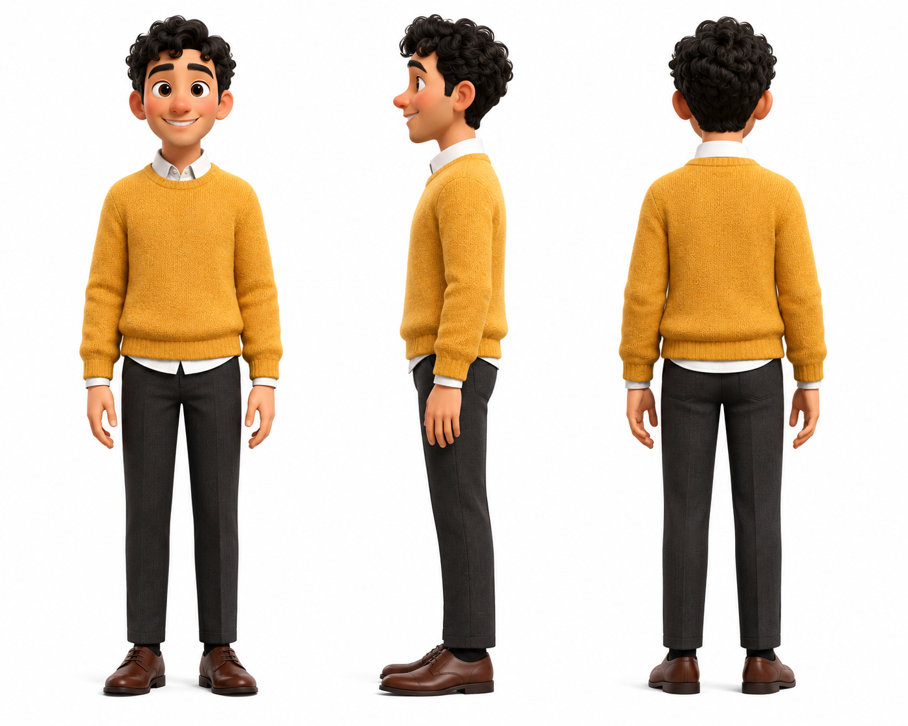 | PixelHaven92 | High | 1402×1122 | 2026.07.15 | `A cinematic close-up portrait of a young woman with straight black bob hair and blunt bangs, wearing a white collared shirt. Bright even studio lighting against a vivid saturated yellow background, with a soft warm rim light along her hair and shoulder. Sharp focus on the eyes, clean skin texture, natural minimal makeup, photorealistic editorial photography style. Head-and-shoulders framing, slight three-quarter angle, calm confident expression.` |
| 9 | Pixar풍 3D 턴어라운드 — 남성 캐주얼 | 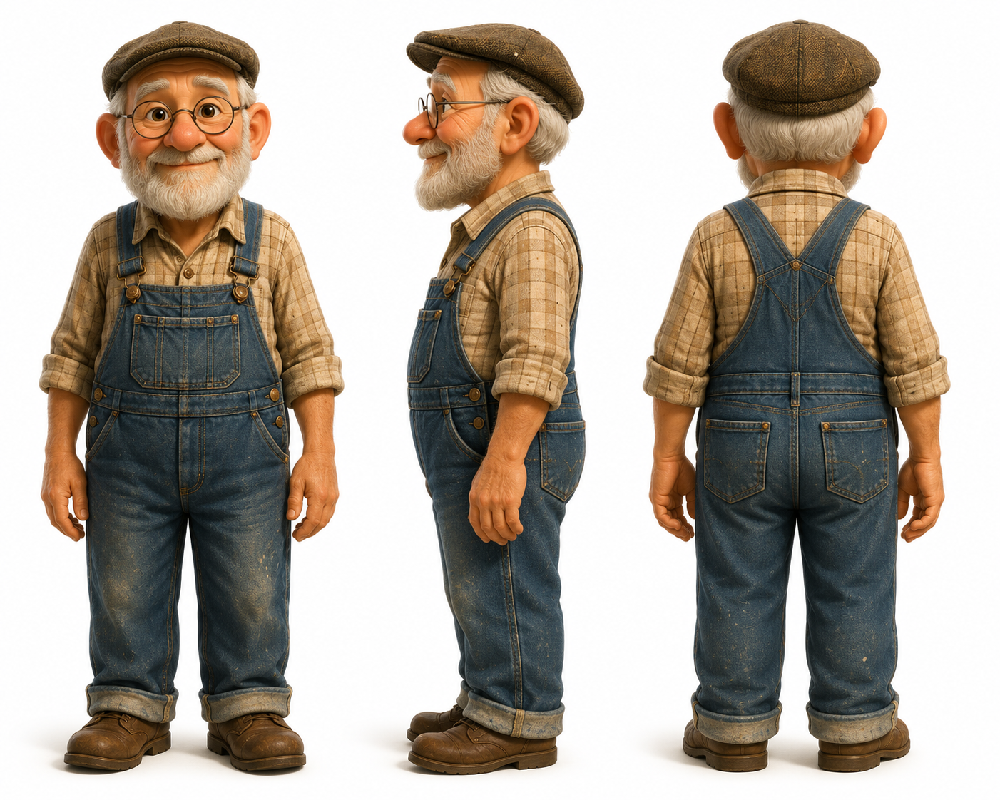 | FrostByte_88 | High | 1402×1122 | 2026.07.15 | `A Pixar-style 3D animated character turnaround of a cheerful young man with short curly black hair, wearing a mustard yellow knit sweater over a white collared shirt and dark trousers. Rounded friendly facial features, warm studio lighting, smooth glossy 3D render shading typical of animated feature films. Show the character's full body three times on a plain white background: front view, side profile, and back view, arranged left to right in that order. Keep the outfit, hairstyle, proportions, and shading fully consistent across all three. Use a simple neutral standing pose, arms relaxed at the sides, no background props.` |
| 10 | Pixar풍 3D 턴어라운드 — 노년 정비공 |  | VelvetOrbit | High | 1402×1122 | 2026.07.15 | `A Pixar-style 3D animated character turnaround of a kind elderly man with a white beard and round glasses, wearing worn denim overalls over a plaid shirt and a flat cap. Warm expressive wrinkles, soft rounded proportions, smooth glossy 3D render shading typical of animated feature films. Show the character's full body three times on a plain white background: front view, side profile, and back view, arranged left to right in that order. Keep the outfit, proportions, and shading fully consistent across all three. Use a simple neutral standing pose, no background props.` |
| 11 | Pixar풍 3D 턴어라운드 — 여우 스카웃 캐릭터 | 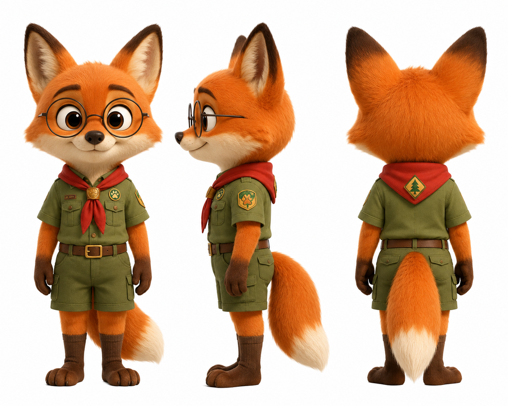 | EchoWillow | High | 1402×1122 | 2026.07.15 | `A Pixar-style 3D animated character turnaround of an anthropomorphic fox character standing upright, wearing a green scout uniform with a red neckerchief and round glasses. Big expressive eyes, soft fur texture, smooth glossy 3D render shading typical of animated feature films. Show the character's full body three times on a plain white background: front view, side profile, and back view, arranged left to right in that order. Keep the outfit, fur color, proportions, and shading fully consistent across all three. Use a simple neutral standing pose, no background props.` |
| 12 | 2D 플랫 애니메 캐릭터 — 세일러 교복 소녀 | 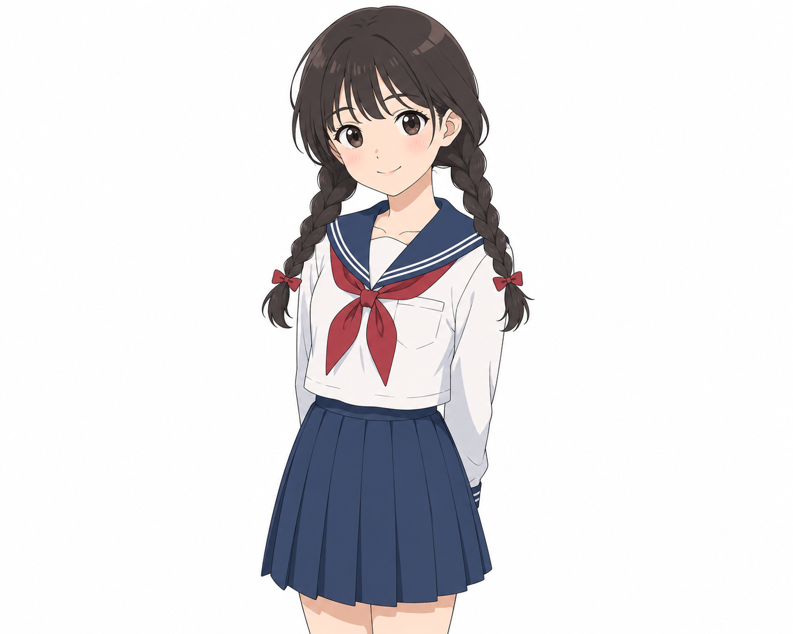 | NocturneKai | High | 1402×1122 | 2026.07.15 | `A flat 2D anime illustration of a girl with twin braided pigtails, wearing a sailor-style school uniform with a red ribbon, standing in a relaxed pose with a gentle smile. Clean vector-like line art, flat cel shading with minimal gradients, soft pastel color palette, pure white background, no shadows.` |
| 13 | 2D 캐릭터 턴어라운드 — 블루헤어 마법사 소년 | 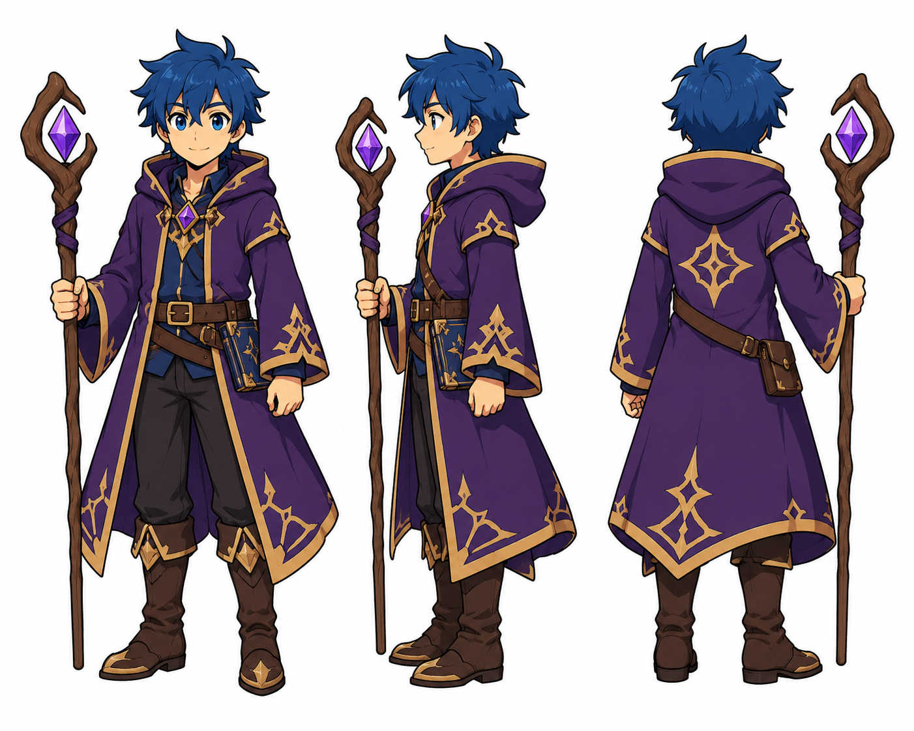 | CobaltRenee | High | 1402×1122 | 2026.07.15 | `A flat 2D game character illustration turnaround of a young male mage with messy blue hair, wearing a hooded purple robe with gold trim and carrying a wooden staff. Clean bold outlines, flat cel shading, vivid saturated colors, no gradients or painterly texture. Show the full body three times on a plain white background: front view, side view, and back view, left to right. Keep the outfit, staff, proportions, and flat shading style consistent across all three. Use a simple standing pose holding the staff the same way in each view.` |
| 14 | 시네마틱 무드컷 — 골드 림라이트 + 코트 | 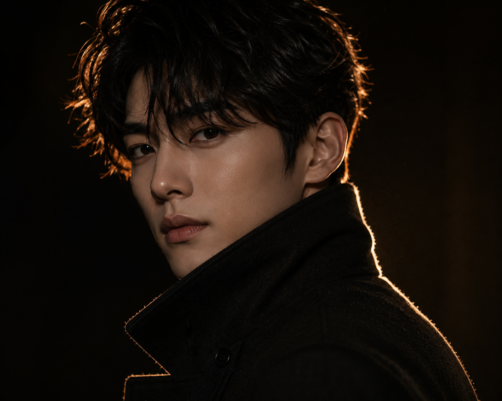 | AmberVoss | High | 1402×1122 | 2026.07.15 | `A cinematic close-up portrait of a young man with tousled dark hair, wearing a black wool coat with the collar popped up. Moody low-key lighting with a warm golden rim light tracing the edge of his hair and shoulder against a near-black background. Photorealistic skin texture, sharp catchlight in the eyes, editorial fashion photography style. Head-and-shoulders framing, slight side angle, calm confident expression.` |
| 15 | 시네마틱 무드컷 — 블루 림라이트 + 후드 | 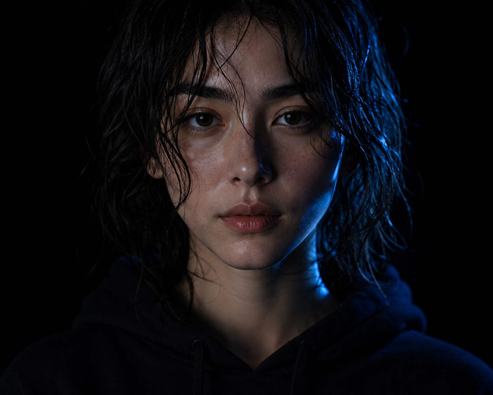 | SolsticeMira | High | 1402×1122 | 2026.07.15 | `A cinematic close-up portrait of a young woman with wet-look wavy dark hair, wearing a plain black hoodie. Moody low-key lighting with a cool blue rim light along her jaw and hair against a pitch-black background. Photorealistic skin texture, subtle freckles, soft naturalistic makeup, editorial photography style. Head-and-shoulders framing, front-facing, direct eye contact with the camera.` |
| 16 | 2D 수채화풍 캐릭터 | 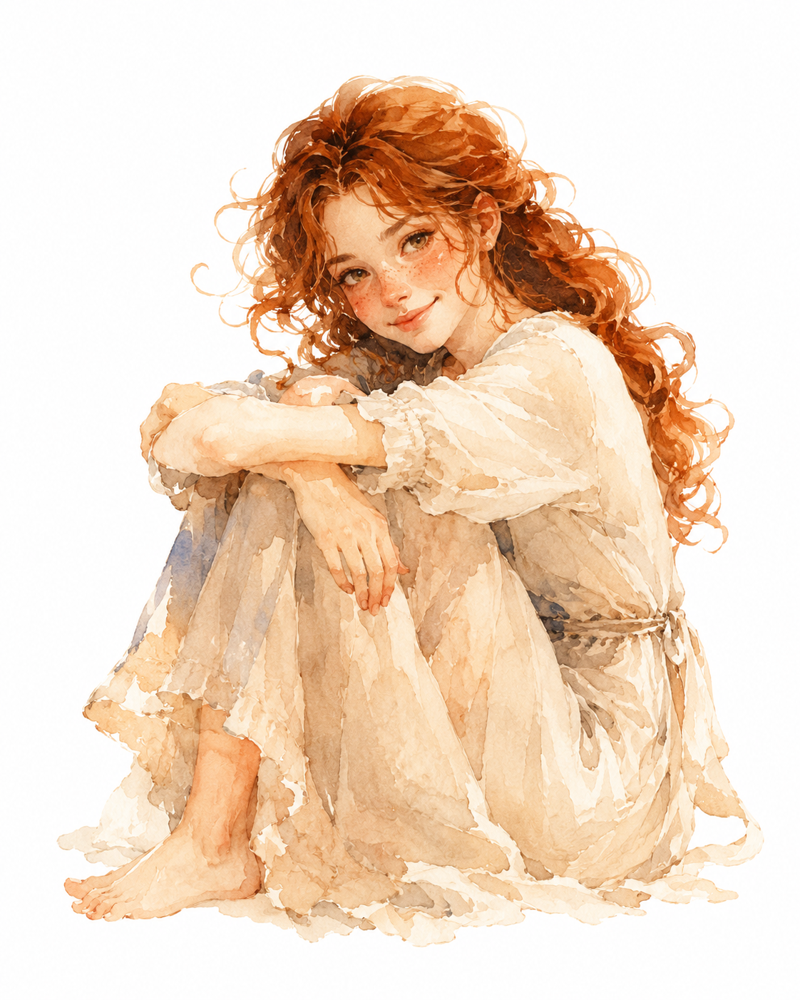 | DriftwoodSam | High | 1122×1402 | 2026.07.15 | `A 2D watercolor-style illustration of a young woman with loose curly auburn hair, wearing a flowing linen dress, sitting with her knees pulled up and a small smile. Soft watercolor textures with visible brush strokes, muted warm color palette, pure white background, no hard outlines.` |
| 17 | 시네마틱 무드컷 — 비비드 코발트블루 배경 | 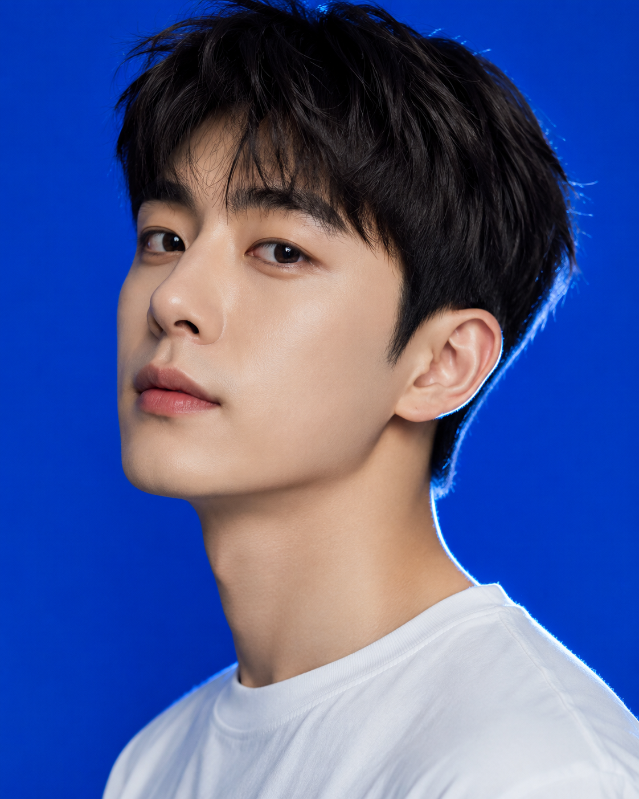 | ThistleKane | High | 1122×1402 | 2026.07.15 | `A cinematic close-up portrait of a young man with short dark hair, wearing a plain white t-shirt. Bright even studio lighting against a vivid saturated cobalt blue background, with a subtle cool white rim light along his jaw and shoulder. Photorealistic skin texture, sharp catchlight in the eyes, editorial fashion photography style. Head-and-shoulders framing, slight side angle, relaxed expression.` |
| 18 | 시네마틱 무드컷 — 비비드 옐로우 배경 (정면) | 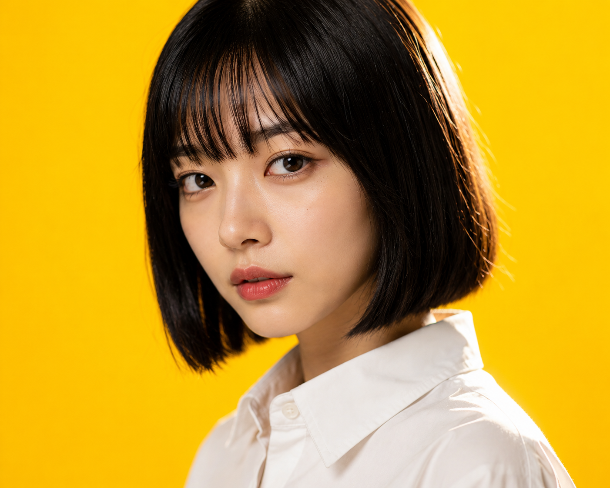 | CinderTalia | High | 1402×1122 | 2026.07.15 | `A cinematic close-up portrait of a young woman with straight black bob hair and blunt bangs, wearing a white collared shirt. Bright even studio lighting against a vivid saturated yellow background, with a soft warm rim light along her hair and shoulder. Sharp focus on the eyes, clean skin texture, natural minimal makeup, photorealistic editorial photography style. Head-and-shoulders framing, slight three-quarter angle, calm confident expression.` |
| 19 | 시네마틱 무드컷 — 비비드 그린 배경 | 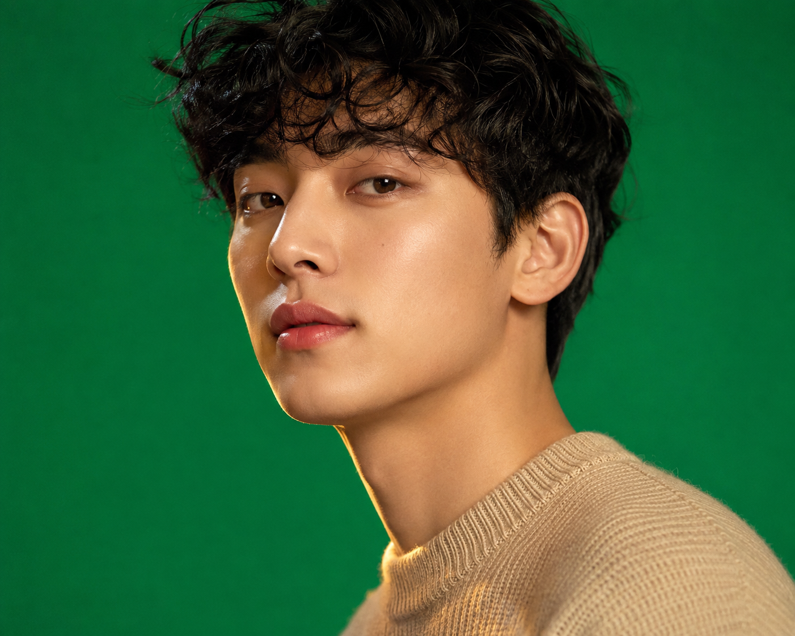 | jinwoo.park | High | 1402×1122 | 2026.07.15 | `A cinematic close-up portrait of a young man with curly dark hair, wearing a beige knit sweater. Bright even studio lighting against a vivid saturated emerald green background, with a subtle warm rim light along his cheekbone and jaw. Photorealistic skin texture, natural expression, editorial photography style. Head-and-shoulders framing, slight side angle, soft confident expression.` |
| 20 | 2D 챠비 스타일 캐릭터 — 스케이트보드 소년 | 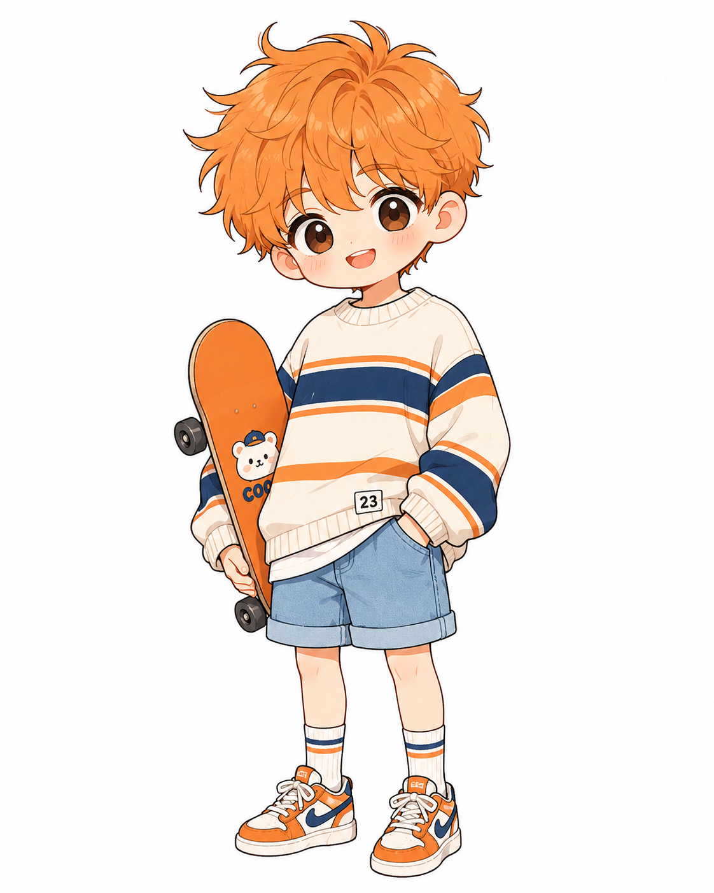 | hazynoon | High | 1122×1402 | 2026.07.15 | `A cute chibi-style 2D anime character of a boy with messy orange hair, wearing an oversized striped sweater and denim shorts, holding a skateboard under one arm. Big expressive eyes, soft rounded proportions, flat pastel coloring, clean line art, pure white background.` |
| 21 | 하이패션 에디토리얼 포트레이트 | 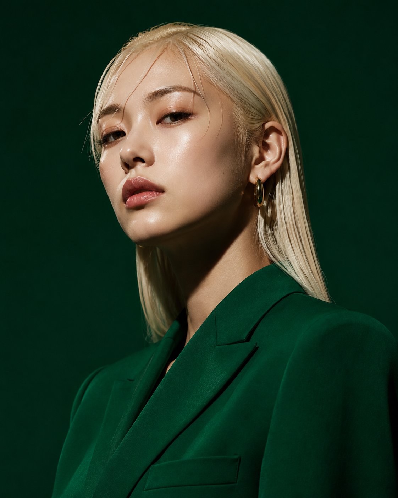 | yuna_ray | High | 1122×1402 | 2026.07.15 | `A high-fashion editorial photograph of a woman with sleek platinum blonde hair, wearing a structured emerald green blazer, dramatic studio lighting with hard shadows, shot on a large format camera. Ultra sharp detail, glossy skin highlights, bold minimalist studio background in deep forest green.` |
| 22 | 시네마틱 무드컷 — 교복 + 퍼플 림라이트 | 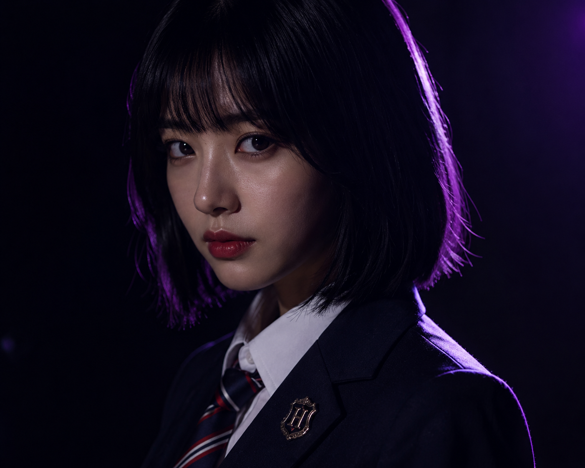 | dustyhalo | High | 1122×1402 | 2026.07.15 | `A cinematic close-up portrait of a young woman with straight black bob hair and blunt bangs, wearing a dark navy school uniform blazer with a striped tie and a crest pin. Moody low-key lighting with a single strong purple rim light outlining her hair and shoulder from the right side, the rest of the scene in near-total darkness. Sharp focus on the eyes, soft skin texture, subtle red-toned lipstick, photorealistic editorial photography style. Head-and-shoulders framing, slight three-quarter angle, direct but subtle eye contact with the camera.` |

---

## 5. 생성자 핸들 배정 현황

| 핸들 | 배정 항목 |
|---|---|
| LumenDrift | 세트1(온실 식물학자) 3장 |
| ObsidianWren | 세트2(심해 탐사자) 3장 |
| HalcyonRae | 세트3(하늘섬 항해사) 3장 |
| mira.oh | 4번 챠비 곰모자 소녀 |
| RippleAsher | 5번 게임 컨셉아트 골드 아머 |
| GoldenHush | 6번 Pixar풍 빈티지 드레스 |
| IndigoFelix | 7번 다크판타지 은발 소드 |
| nova_kim | freeset_1 |
| QuartzNova | freeset_2 |
| aiden.lee | freeset_3 |
| SilverMirage | freeset_4 |
| dewyjuicy | freeset_5 |
| MossVantage | freeset_6 |
| seol.han | freeset_7 |
| PixelHaven92 | 8번 무드컷 옐로우(측면) |
| FrostByte_88 | 9번 Pixar 남성 캐주얼 |
| VelvetOrbit | 10번 Pixar 노년 정비공 |
| EchoWillow | 11번 Pixar 여우 스카웃 |
| NocturneKai | 12번 2D 세일러 교복 소녀 |
| CobaltRenee | 13번 2D 마법사 소년 턴어라운드 |
| AmberVoss | 14번 무드컷 골드 림라이트 |
| SolsticeMira | 15번 무드컷 블루 림라이트 |
| DriftwoodSam | 16번 2D 수채화 캐릭터 |
| ThistleKane | 17번 무드컷 코발트블루 |
| CinderTalia | 18번 무드컷 옐로우(정면) |
| jinwoo.park | 19번 무드컷 그린 |
| hazynoon | 20번 2D 챠비 스케이트보드 소년 |
| yuna_ray | 21번 하이패션 에디토리얼 |
| dustyhalo | 22번 무드컷 퍼플 림라이트(교복) |

> 남은 핸들 5개(ezra.moon, cloudberry_, tae_min92, velvetnoon, soft_serene)는 다음 배치에 배정. 소진되면 새 핸들 추가 필요. 같은 핸들 재사용 최소화 권장(다양한 사용자처럼 보이게 하기 위함).

---

## 6. 폴더 구성 안내

이 폴더(`01_기획/테스트프롬프트`)로 프리셋 관련 자료를 전부 모았습니다.

> 3x3 스토리보드 그리드는 실제 파이프라인상 A2팀이 생성하는 자산이 아니라(B팀 산출물 검증용 테스트) 이 프리셋 문서에서는 제외했습니다. 관련 이미지·프롬프트는 `2026-07-14_3x3그리드_생성이미지/`, `2026-07-14_3x3그리드_영상제작_프롬프트_v1.md`에 테스트 목적으로만 보존됩니다.

| 폴더/파일 | 내용 |
|---|---|
| `이미지/` | 프리셋용으로 생성한 35개 원본 이미지 (세트1~3 A/B 9장 + 턴어라운드 단독 4종 + 낱장 7종 + 낱장 추가분 15종) |
| `2026-07-14_탐색하기_프리셋_후보이미지.md` + 동명 폴더 | Civitai 임시 목업 47종 — 라이선스 확인 불가로 **보류 상태**, 참고용으로만 보존 |
| `2026-07-14_3x3그리드_생성이미지/` | 3x3 그리드 테스트 이미지 5종 (원본 세트1~4 + 순서 수정 재생성본) — 파이프라인 테스트 전용, 프리셋 아님 |
| `2026-07-14_3x3그리드_영상제작_프롬프트_v1.md` | 영상 파이프라인 테스트용 프롬프트 문서 |
| `프리셋_영상_생성/` | fal.ai API 연동 스크립트 (`test_generate.py`), `.env`(키 보관, git 제외) |
