# 홈 화면 프리셋 최종본 (GPT Image 2 자체 생성)
> 작성일: 2026-07-15 | 작성자: 이슬기
> 이전 문서: [[2026-07-14_탐색하기_프리셋_후보이미지]] (Civitai 임시 목업, 라이선스 확인 불가로 보류)
> 이 문서부터는 **GPT Image 2로 직접 생성한 자산**만 다룬다 — 상업적 사용 문제 없음(OpenAI 이용약관, 플랜 무관 아웃풋 권리 사용자 귀속).
> 상세 정보 패널 필드 구성: **생성자 / 품질 / 사이즈 / 생성일자 / 프롬프트** (5개 — 기존 Civitai 문서의 작성자/사이즈/생성일자/모델/상업적사용 구조에서 갱신됨)
> 생성자 필드는 실제로는 이슬기·손찬용 PM 2인이 만들었으나, 서비스 느낌을 위해 랜덤 사용자 핸들로 표기함 (아래 각 항목에 배정).

---

## 1. 캐릭터 세트 3종 (메뉴 A → 메뉴 B 데모)

메뉴 A(초기 레퍼런스: 배경 1장 + 캐릭터 다각도)와 메뉴 B(디테일 키이미지: 풀 레퍼런스 시트)가 실제로 이어지는 흐름을 보여주는 데모 세트. 캐릭터 시트는 PART1+PART2 텍스트 스펙보다 더 완성도 높게 나와서(ID 코드, 소속 로고, 스탯 블록) 그대로 상세 패널 자산으로 써도 될 수준.

### 세트 1 — 온실 식물학자 (Iris Vane)

**메뉴 A — 배경**
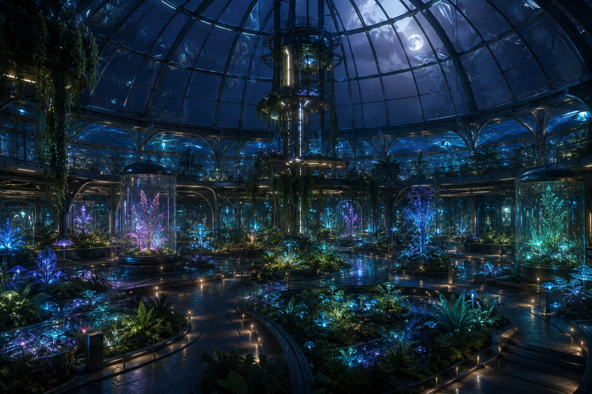
- 생성자: LumenDrift | 품질: High | 사이즈: 1536×1024 | 생성일자: 2026.07.15
- 프롬프트: `futuristic greenhouse interior filled with glowing bioluminescent plants, glass dome ceiling letting in soft moonlight, establishing shot, no characters, sci-fi botanical style, high detail`

**메뉴 A — 캐릭터 턴어라운드**
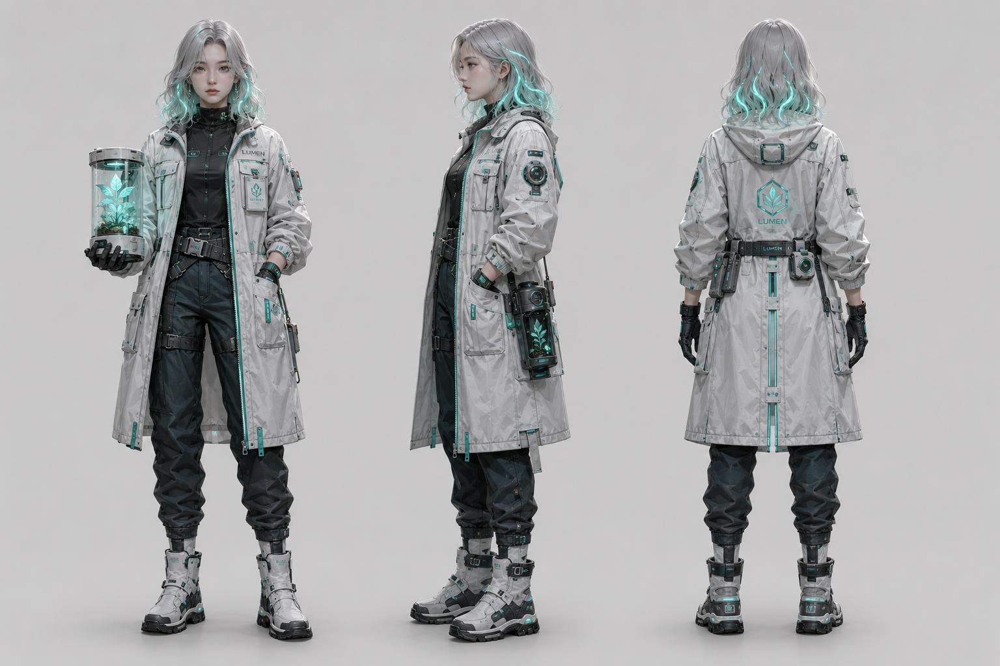
- 생성자: LumenDrift | 품질: High | 사이즈: 1536×1024 | 생성일자: 2026.07.15
- 프롬프트: `young woman botanist, mid-20s, shoulder-length silver hair with teal bioluminescent streaks, character turnaround sheet, front view, side view, back view, plain light-gray background, studio lighting, even and diffused, sci-fi illustration style, high detail`

**메뉴 B — 키이미지(레퍼런스 시트)**

- 생성자: LumenDrift | 품질: High | 사이즈: 1672×941 | 생성일자: 2026.07.15
- 프롬프트: PART1+PART2 구조 (`2026-07-08_메뉴AB_프롬프트가이드_v1.md` 3.1 템플릿) — 이전 답변에서 전달한 Iris Vane 전체 프롬프트 참고

---

### 세트 2 — 심해 탐사자 (Dorian Reyes)

**메뉴 A — 배경**
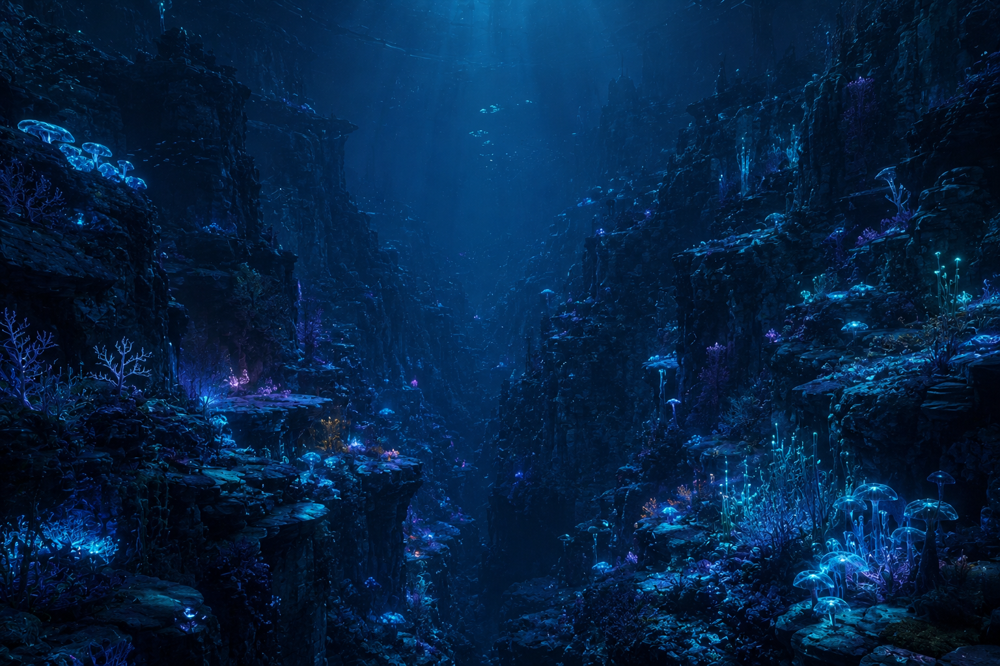
- 생성자: ObsidianWren | 품질: High | 사이즈: 1536×1024 | 생성일자: 2026.07.15
- 프롬프트: `deep ocean trench with bioluminescent coral formations, faint blue light filtering from above, establishing shot, no characters, underwater sci-fi style, high detail`

**메뉴 A — 캐릭터 턴어라운드**
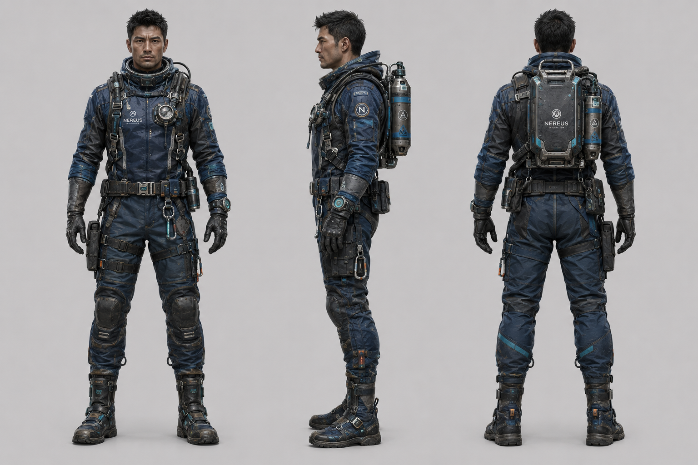
- 생성자: ObsidianWren | 품질: High | 사이즈: 1536×1024 | 생성일자: 2026.07.15
- 프롬프트: `young man deep-sea explorer, early 30s, short dark hair, weathered tan skin, character turnaround sheet, front view, side view, back view, plain light-gray background, studio lighting, even and diffused, sci-fi realistic illustration style, high detail`

**메뉴 B — 키이미지(레퍼런스 시트)**

- 생성자: ObsidianWren | 품질: High | 사이즈: 1672×941 | 생성일자: 2026.07.15
- 프롬프트: PART1+PART2 구조 — 이전 답변에서 전달한 Dorian Reyes 전체 프롬프트 참고

---

### 세트 3 — 하늘섬 항해사 (Wren Calloway)

**메뉴 A — 배경**
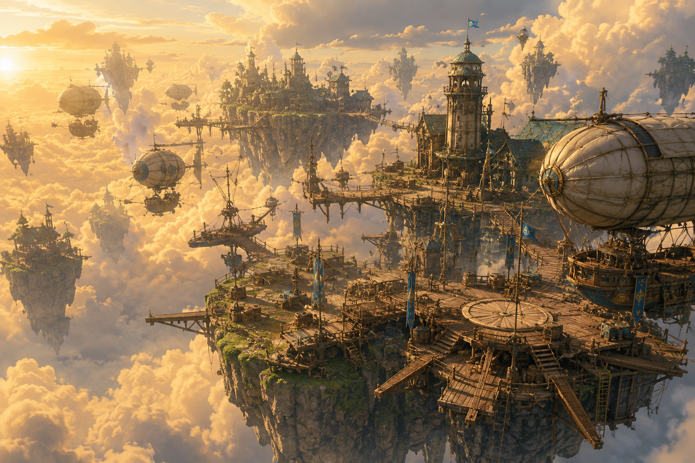
- 생성자: HalcyonRae | 품질: High | 사이즈: 1536×1024 | 생성일자: 2026.07.15
- 프롬프트: `floating sky island archipelago with wooden airship docks, golden clouds and distant floating rocks, establishing shot, no characters, fantasy adventure style, high detail`

**메뉴 A — 캐릭터 턴어라운드**
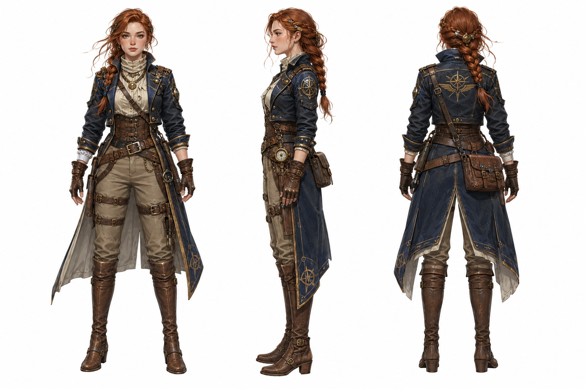
- 생성자: HalcyonRae | 품질: High | 사이즈: 1536×1024 | 생성일자: 2026.07.15
- 프롬프트: `young woman sky-ship navigator, mid-20s, wind-swept auburn hair in a loose braid, character turnaround sheet, front view, side view, back view, plain white background, studio lighting, even and diffused, fantasy adventure illustration style, high detail`

**메뉴 B — 키이미지(레퍼런스 시트)**

- 생성자: HalcyonRae | 품질: High | 사이즈: 1672×941 | 생성일자: 2026.07.15
- 프롬프트: PART1+PART2 구조 — 이전 답변에서 전달한 Wren Calloway 전체 프롬프트 참고

---

## 2. 캐릭터 턴어라운드 단독 4종 (메뉴 A only — 배경 없음, 스타일 다양화)

기존 세트1~3과 달리 배경 없이 **턴어라운드(3뷰)만 단독으로 뽑은 세트**. 아트 스타일 다양성 확보용(챠비/게임 컨셉아트/Pixar풍/다크판타지 애니메).

| # | 컨셉 | 이미지 | 생성자 | 품질 | 사이즈 | 생성일자 | 프롬프트 |
|---|---|---|---|---|---|---|---|
| 4 | 챠비 애니메 (곰 모자 소녀) | 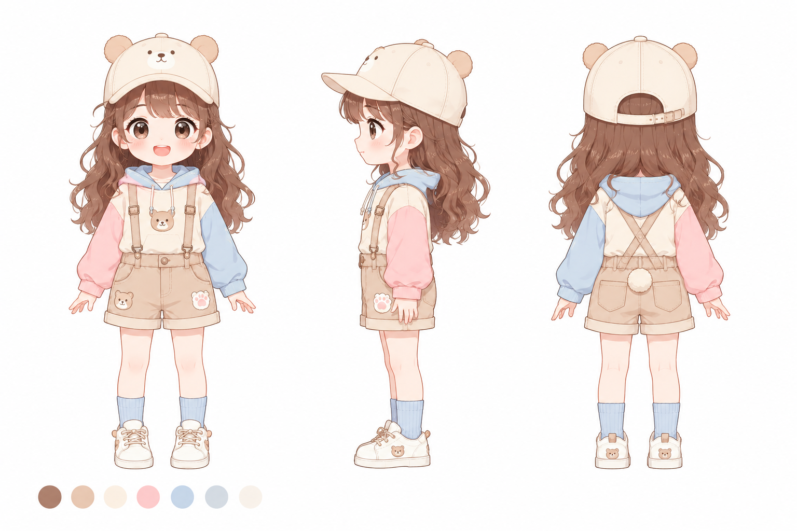 | mira.oh | High | 1536×1024 | 2026.07.15 | `A character reference sheet of a cute chibi-style anime girl with wavy brown hair, wearing a cream bear-ear cap, a pastel hoodie with suspender-style shorts, blue socks, and white sneakers. Soft pastel colors, big expressive eyes, rounded friendly proportions. Show the full body of the character three times side by side on a pure white background with no shadows: front view on the left, side (profile) view in the middle, and back view on the right. Keep the outfit, hairstyle, proportions, and colors perfectly consistent across all three poses. Use a simple neutral standing pose for all three. Leave clear empty space between each figure so they read as separate panels. Add a small color palette swatch in the bottom left showing the character's main colors.` |
| 5 | 게임 컨셉아트 판타지 전사 (골드 아머) | 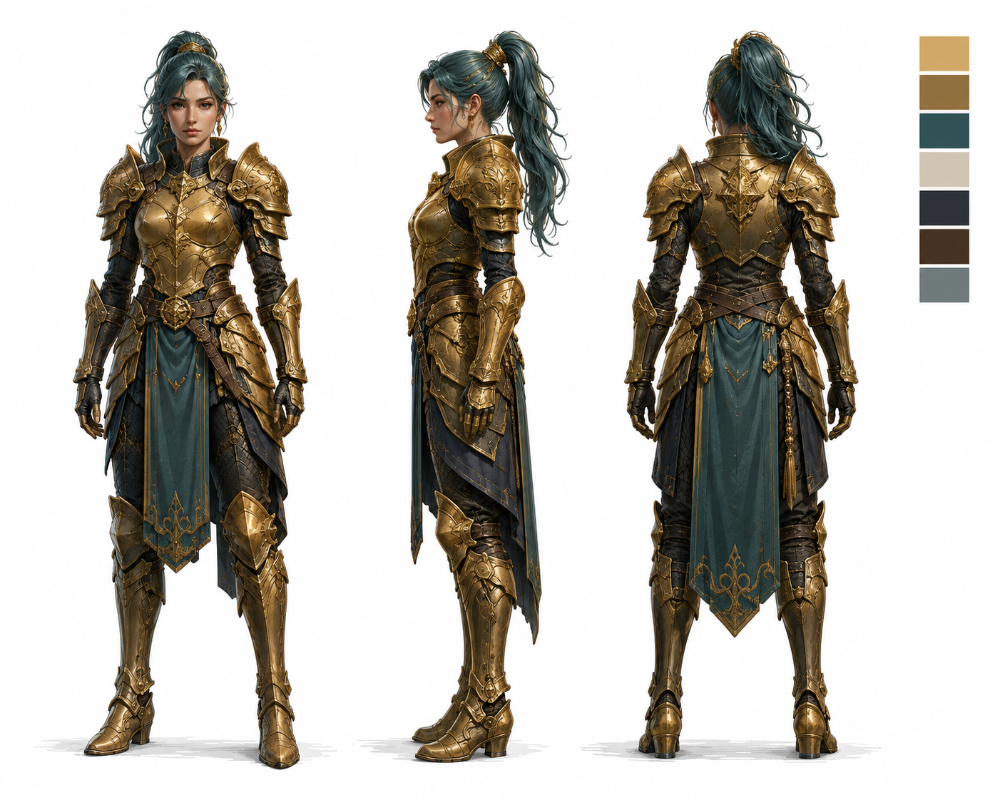 | RippleAsher | High | 1402×1122 | 2026.07.15 | `A game character concept art reference sheet of a female fantasy warrior with teal hair, wearing ornate gold plated armor with shoulder guards and a draped cloth sash at the waist. Semi-realistic painterly game art style with warm rim lighting and soft highlights on the metal armor. Arrange the full body of the character three times on a clean white background: front view, side (profile) view, and back view, left to right. Keep the armor design, proportions, colors, and lighting identical across all three views. Use a relaxed standing pose. Add a color palette swatch in the top right corner showing the armor's key colors.` |
| 6 | Pixar/디즈니풍 3D 캐릭터 (빈티지 드레스) | 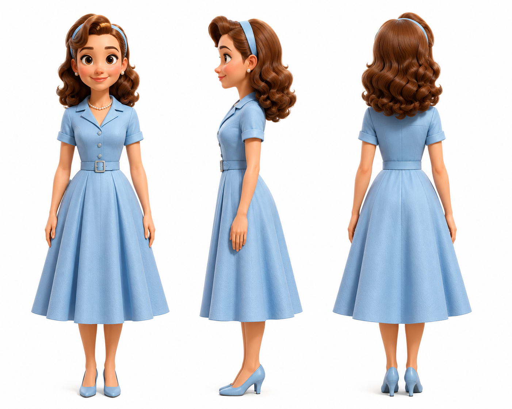 | GoldenHush | High | 1402×1122 | 2026.07.15 | `A Pixar-style 3D animated character turnaround of a friendly young woman with wavy brown hair in a headband, wearing a 1950s-style light blue dress with a belt and pearl jewelry. Soft rounded facial features, warm studio lighting, smooth glossy 3D render shading typical of animated feature films. Show the character's full body three times on a plain white background: front view, side profile, and back view, arranged left to right in that order. Keep the dress, hairstyle, proportions, and shading fully consistent across all three. Use a simple neutral standing pose, arms relaxed at the sides, no background props.` |
| 7 | 다크판타지 애니메 (은발 소드 유저) | 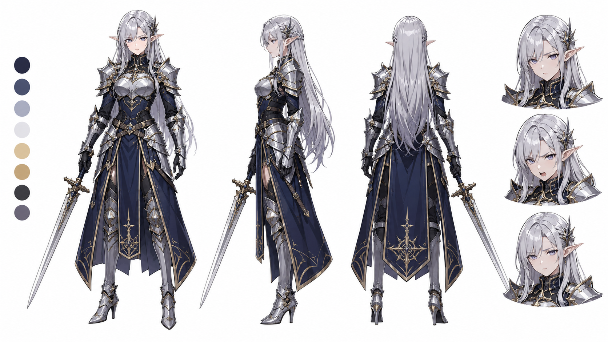 | IndigoFelix | High | 1672×941 | 2026.07.15 | `An anime-style dark fantasy character design sheet of a female warrior with long silver hair and pointed elf ears, wearing navy and silver plate armor with gold trim, holding a long sword in one hand, and pointed heeled boots. Detailed line art with sharp cel shading. Display the full body three times on a pure white background: front view, side view, and back view, left to right, all in the same standing pose with the sword held identically in each. Keep the armor details, hair, and proportions consistent across all views. Add a color palette swatch on the left side, and include three small facial expression variations on the right side of the sheet.` |

> 참고: 이번 4종은 배경 없이 턴어라운드만 단독 프리셋으로 쓰는 경우도 상정한 것이라, 세트1~3(배경+턴어라운드+레퍼런스시트 풀세트)과는 용도가 다름 — 홈 화면에서는 "스타일 다양성 보여주기용 단독 캐릭터 카드"로 배치하는 걸 권장.

---

## 3. 낱장 프리셋 7종 (캐릭터 단독 / 배경 단독)

| # | 이미지 | 생성자 | 품질 | 사이즈 | 생성일자 | 프롬프트 |
|---|---|---|---|---|---|---|
| 1 | 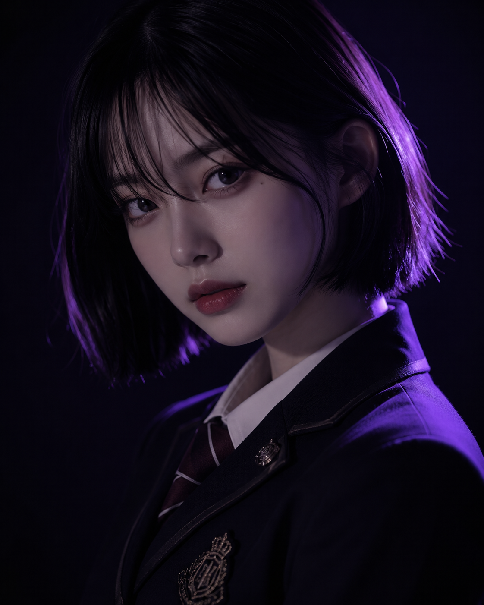 | nova_kim | High | 1122×1402 | 2026.07.15 | `close-up portrait of a young woman with short black bob hair, wearing a dark academia uniform, moody purple neon rim light, cinematic shallow depth of field, no background detail, plain dark backdrop` |
| 2 | 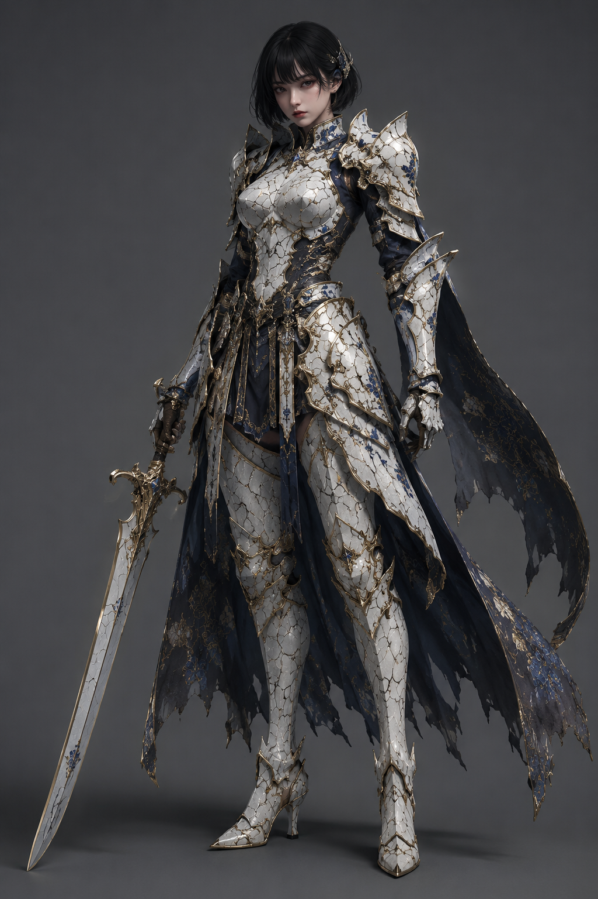 | QuartzNova | High | 1024×1536 | 2026.07.15 | `full-body shot of a fantasy warrior character in ornate cracked porcelain-textured armor, dramatic studio lighting, isolated on neutral gray background, character-sheet style` |
| 3 | 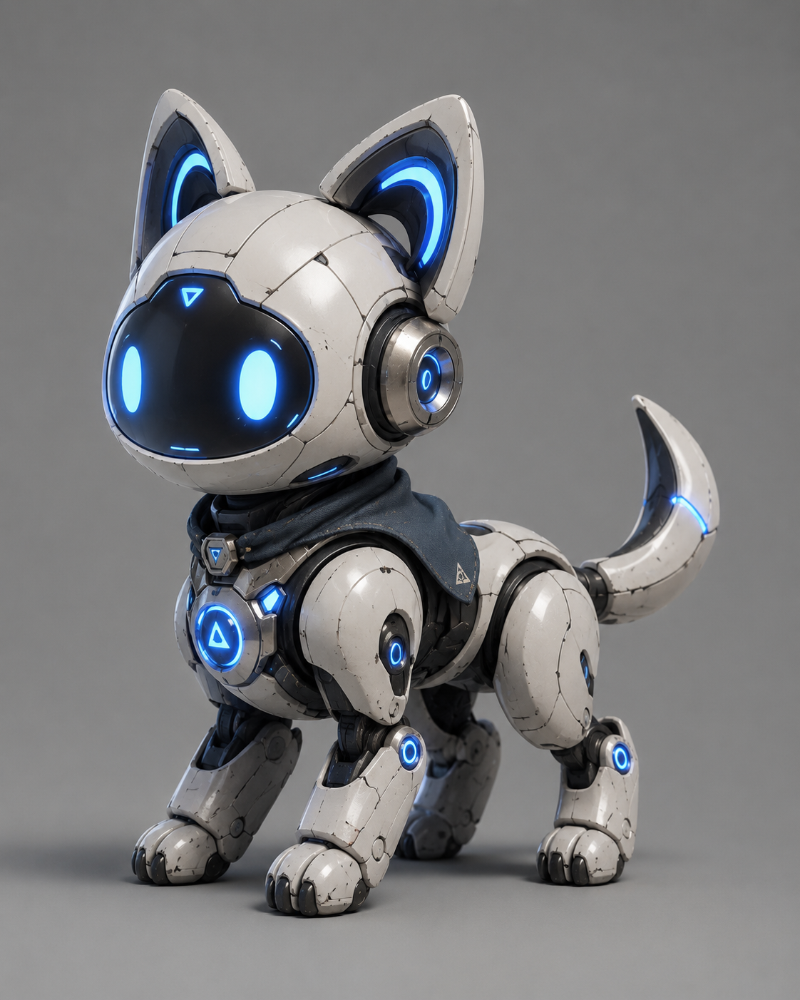 | aiden.lee | High | 1122×1402 | 2026.07.15 | `stylized 3D character, a small robotic companion creature with glowing blue accents, three-quarter view, soft studio lighting, plain backdrop for easy compositing` |
| 4 | 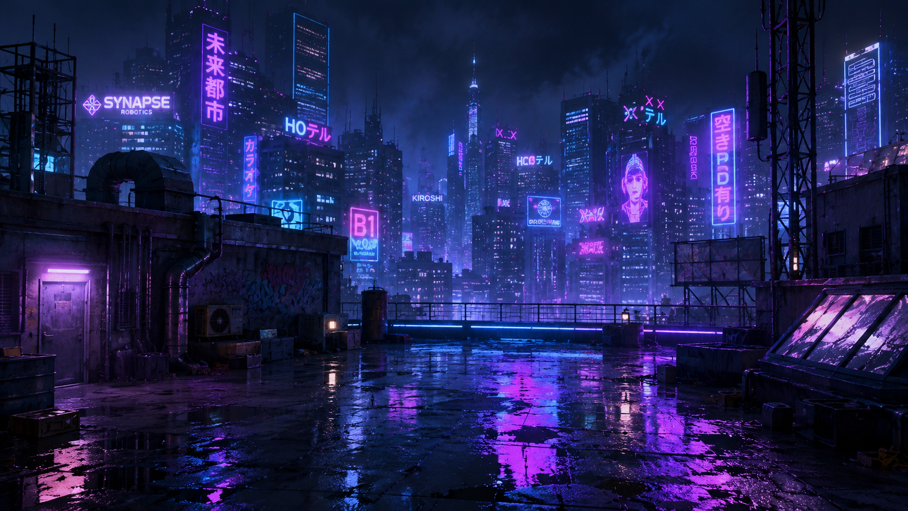 | SilverMirage | High | 1671×941 | 2026.07.15 | `wide cinematic shot of an empty neon-lit cyberpunk rooftop at night, rain-soaked ground reflecting purple and blue signage, no characters, atmospheric fog` |
| 5 | 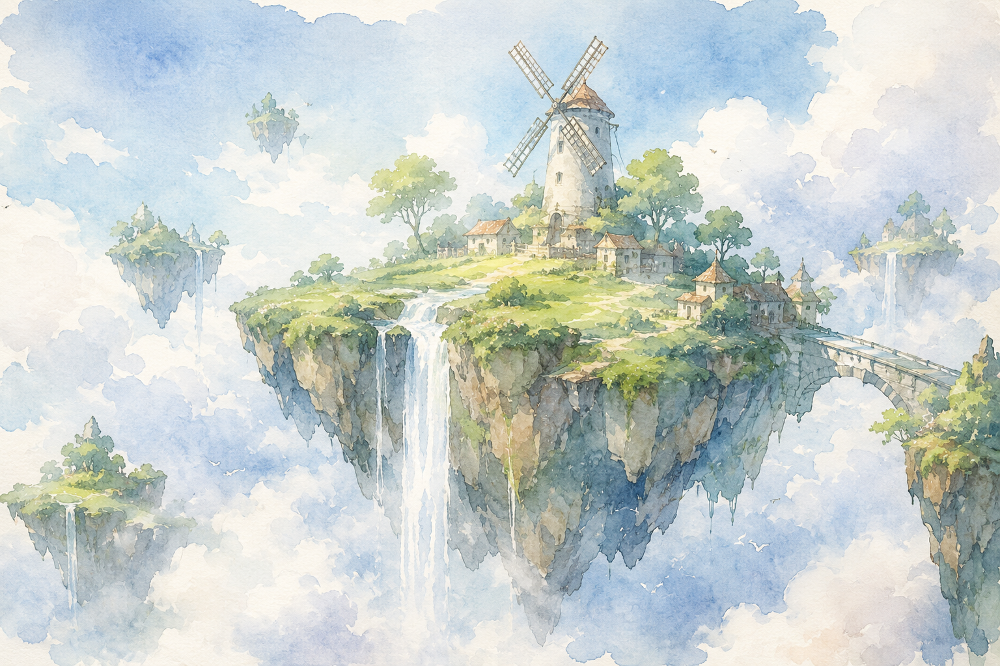 | dewyjuicy | High | 1536×1024 | 2026.07.15 | `watercolor-style landscape of a floating sky island with a waterfall and windmill, soft pastel palette, no figures, dreamy atmosphere` |
| 6 | 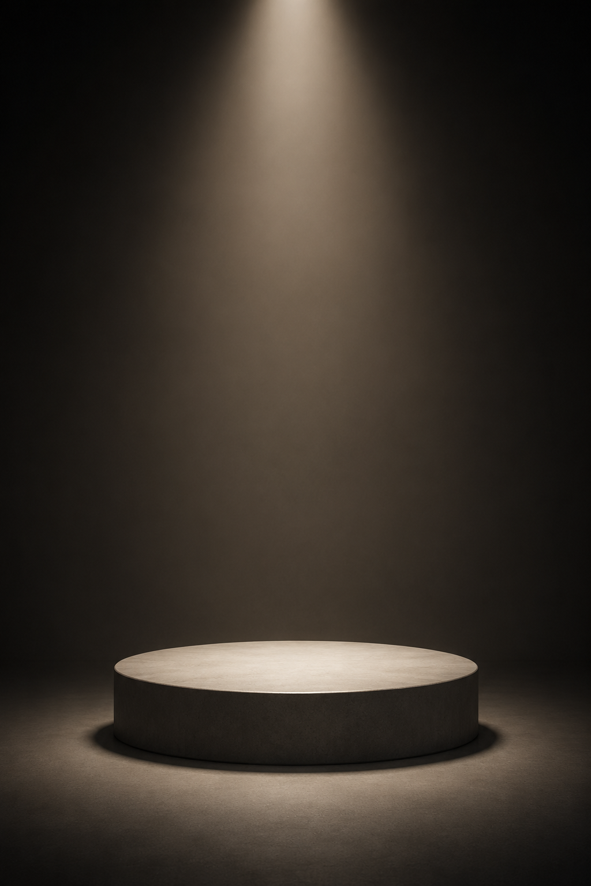 | MossVantage | High | 1024×1535 | 2026.07.15 | `minimalist product-ad style scene, a single spotlight on an empty pedestal in a dark studio, soft gradient background, no subject placed yet` |
| 7 |  | seol.han | High | 1672×941 | 2026.07.15 | `cinematic wide shot of a misty rice paddy at dawn, empty foreground path, warm golden light breaking through fog, no characters` |

---

## 4. 스토리보드 그리드 1종 (재생성본 — 순서 수정 완료)


- 생성자: CinderTalia | 품질: High | 사이즈: 1672×941 | 생성일자: 2026.07.15
- 프롬프트: `2026-07-14_3x3그리드_생성이미지/세트4_pixar정글탐험.png` 원본의 재생성 버전 — 6번 패널까지 열쇠 미접촉, 7번 패널에서 첫 접촉으로 순서 수정 (상세 프롬프트는 하단 참고)
- 비고: 기존 세트4(Pixar 스타일 리스크 + 순서 오류)를 대체하는 최종본. 원본 세트1~3(액션추격/감정대화/댄스퍼포먼스)은 `2026-07-14_3x3그리드_생성이미지/` 폴더에 그대로 보존.

<details>
<summary>전체 프롬프트 펼치기</summary>

```
A young adventurer boy exploring an overgrown jungle temple, discovering and finally claiming a glowing ancient key.
Stylized 3D animation look with warm storybook illustration texture — soft painterly shading instead of glossy photoreal CG render.
Natural proportions (not oversized head/eyes), expressive but grounded facial design.

3x3 grid, 9 sequential shots in strict story order — the key must NOT appear in the boy's hand until shot 7:
1. Wide establishing shot: boy standing before the temple entrance, key nowhere visible.
2. Top-down maze view: boy navigating the stone maze, key nowhere visible.
3. Mid-air leap between broken platforms, key nowhere visible.
4. Running shot down a glowing corridor, key nowhere visible.
5. Boy facing a carved stone door with a glowing symbol, key still not visible — this is the obstacle, not the reward.
6. Boy reaching his hand toward the glowing key suspended in a beam of light inside the door — hand NOT yet touching it, key still floating, tension shot.
7. Close-up: boy's hand finally grasping the glowing key as the temple begins to crack and collapse around him — this is the FIRST shot the key touches his hand.
8. Falling/escaping shot: boy tumbling through a collapsing corridor, key now firmly held in his fist.
9. Triumphant final shot: boy outside the temple in daylight, smiling, holding the key up — key clearly held throughout this and the previous shot only.

Scene: moss-covered stone ruins, dappled sunlight through jungle canopy, teal bioluminescent carvings.
Lighting: warm golden-hour key light, cool teal rim light from the ruins.
Style: semi-stylized 3D illustration, painterly texture overlay, not photorealistic, avoid generic "big-eyed mascot" character design.
Aspect ratio: 16:9 per panel, 3x3 grid layout.
```

</details>

---

## 5. 생성자 핸들 배정 현황

| 핸들 | 배정 항목 |
|---|---|
| LumenDrift | 세트1(온실 식물학자) 3장 |
| ObsidianWren | 세트2(심해 탐사자) 3장 |
| HalcyonRae | 세트3(하늘섬 항해사) 3장 |
| mira.oh | 4번 챠비 곰모자 소녀 |
| RippleAsher | 5번 게임 컨셉아트 골드 아머 |
| GoldenHush | 6번 Pixar풍 빈티지 드레스 |
| IndigoFelix | 7번 다크판타지 은발 소드 |
| nova_kim | freeset_1 |
| QuartzNova | freeset_2 |
| aiden.lee | freeset_3 |
| SilverMirage | freeset_4 |
| dewyjuicy | freeset_5 |
| MossVantage | freeset_6 |
| seol.han | freeset_7 |
| CinderTalia | freeset_reprompt |

> 남은 핸들 20개(PixelHaven92, FrostByte_88, VelvetOrbit, EchoWillow, NocturneKai, CobaltRenee, AmberVoss, SolsticeMira, DriftwoodSam, ThistleKane, jinwoo.park, hazynoon, yuna_ray, dustyhalo, ezra.moon, cloudberry_, seol.han 중복 제외, tae_min92, velvetnoon, soft_serene)는 향후 추가 생성분에 배정. 같은 핸들 재사용 최소화 권장(다양한 사용자처럼 보이게 하기 위함).

---

## 6. 폴더 구성 안내

이 폴더(`01_기획/테스트프롬프트`)로 프리셋 관련 자료를 전부 모았습니다.

| 폴더/파일 | 내용 |
|---|---|
| `이미지/` | 이번에 생성한 21개 원본 이미지 (세트1~3 A/B 9장 + 턴어라운드 단독 4종 + 낱장 7종 + 재생성 그리드 1장) |
| `2026-07-14_탐색하기_프리셋_후보이미지.md` + 동명 폴더 | Civitai 임시 목업 47종 — 라이선스 확인 불가로 **보류 상태**, 참고용으로만 보존 |
| `2026-07-14_3x3그리드_생성이미지/` | 3x3 그리드 원본 4세트 (세트4만 위 3장에서 재생성본으로 대체됨) |
| `2026-07-14_3x3그리드_영상제작_프롬프트_v1.md` | 영상 파이프라인 테스트용 프롬프트 문서 |
| `프리셋_영상_생성/` | fal.ai API 연동 스크립트 (`test_generate.py`), `.env`(키 보관, git 제외) |
