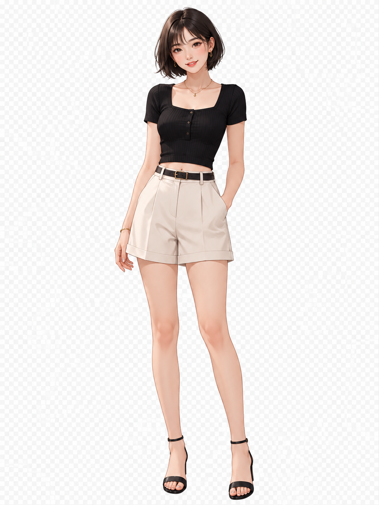

# 오전 논의 정리 — 전달용

> 일시: 2026-07-08 (수) 오전
> 참여: A2 팀\
> 목적: 회의록 취합용 — 오전 중 나눈 대화 내용 전달

***

## 1. 이미지 생성 메뉴 2단계 분리 결정

**배경**
한 번의 프롬프트로 \[참고 이미지 ①②] 같은 최종 키이미지 세트(정면·측면·후면·표정·장비 클로즈업 등 레퍼런스 시트 형태)를 바로 출력하는 것은 어렵다고 BE·디자이너와 함께 판단함. 이에 따라 메뉴를 2단계로 분리하기로 함.

**메뉴 1 — 초기 생성**

* 사용자가 간단한 프롬프트만 입력
* 출력: 배경 이미지 1장 + 캐릭터 여러 각도(정면/측면/후면 등) 이미지
* 참고 이미지:

  
  *배경 이미지 예시 (해변)*

  
  *캐릭터 이미지 예시 (배경 제거된 단일 인물 컷)*

**메뉴 2 — 디테일 생성**

* 메뉴 1 이후 다음 단계로 이동
* 사용자가 디테일한 프롬프트(스타일·의상·소품·색상 코드 등)를 입력
* 출력: 캐릭터 디자인 레퍼런스 시트 형태의 최종 키이미지 세트 (턴어라운드 + 표정 + 소품 클로즈업)
* 참고 이미지:

  
  *"미라 한" 캐릭터 설정표 (전신 턴어라운드·표정·소품·컬러 팔레트·세계관)*

  
  *"Vessa Morivan" 캐릭터 설정표 (턴어라운드·표정·디테일 크래프트·시그니처 프롭·컬러 팔레트)*

***

## 2. 키이미지 프롬프트 예시 (참고용)

디테일 생성 단계에서 사용할 프롬프트 형식 예시. PART 1(서술형 설명) + PART 2(JSON 구조화 항목: SUBJECT, CLOTHING & STYLING, ACCESSORIES, SCENE, BACKGROUND, LIGHTING, TECHNICAL, COMPOSITION, STYLE, ASPECT RATIO, CONSTRAINTS)로 구성.

> 예시 캐릭터: Mira Han (17세, 포탈을 여는 고등학생 콘셉트, 어반 판타지 스타일, 블랙+퍼플 네온 컬러 팔레트)
> 전체 예시 프롬프트는 별도 첨부 참고 (원본 그대로 유지 필요 시 요청).

***

## 3. 사이드바 속성 선택 UI 고려

사용자가 처음부터 캐릭터 설정값이 담긴 상세 프롬프트를 직접 입력할 수도 있지만, 그렇지 않은 경우도 있을 것으로 예상됨. 이에 대응해 사이드바에 헤어·의상·색상 등 속성을 선택할 수 있는 항목을 넣는 방향도 함께 고려 중.

***

## 4. 디자이너(이예린) — 영상 생성 유료 계정 관련 문의 및 답변

* 이예린 디자이너: 이미지는 레퍼런스 사이트 무료 크레딧으로 어느 정도 생성 테스트가 가능했으나, 영상은 무료로는 생성이 어려운 편이라 KX 측 유료 계정 정보를 받아볼 수 있는지 문의
* 답변: 계정 정보 공유는 어려울 것으로 안내함

***

## 5. BE(김유신) — 내부 테스트 일정 및 비용 관리 논의

**내부 테스트 가능 여부**

* fal.ai API를 우리 쪽에서 붙여서 사용하는 구조이므로, API 연동 상태에서 내부 테스트가 가능한지 BE에 문의
* 김유신 개발자 답변: 늦어도 이번 주, 빠르면 오늘 중으로 테스트 가능하도록 준비 가능

**BE 자체 임의 테스트 관련 협의**

* BE에서 API 연동 상태로 임의 테스트를 진행해도 되는지 문의
* 답변: 테스트까지 감안해 예산안을 여유 있게 책정했다고 안내
* 다만 fal.ai는 Hard Limit 설정이 불가능해, 사용량을 KX 측에 계속 확인 요청해야 하는 번거로움이 있어 테스트는 적당히 진행해달라고 요청
* 비용 최소화 방향 예시 제시: Seedance 2.0의 경우 최대 15초 영상 생성이 가능하나, 내부 테스트 시에는 3초 영상 등 짧은 길이로 진행하는 방식 제안

***

## 6. FE(김은재) — Vercel PD 계정 초대 및 확인 필요 사항

* 김은재 FE 개발자가 Vercel에 PD님 계정을 초대해 둔 상태
* 아직 PD님이 초대를 승인하지 않으신 상태로, **PD님 확인 후 참여(초대 수락) 여부 확인 필요**
* 참여 확인 후 **PD님 결제 정보 등록**이 필요함

> **PM 액션 아이템:** PD님께 Vercel 초대 확인 및 수락 요청 → 수락 후 결제 정보 등록 안내

***

## 7. B1팀 — 사내 로그인/유저 DB 통합 문의 및 A2팀 답변

* B1팀 PM 고다희님이 로켓단 DEV 채널에 문의: B1팀 백엔드와 '사내 로그인 및 유저 데이터(user 테이블)' 논의 중, 전체 프로젝트 간 싱크가 필요하다고 판단해 공유
* B1팀 방향: 자유 회원가입 금지, 사내 화이트리스트 인원만 구글 소셜 로그인(OAuth)으로 진입
* B1팀 요청 사항: 추후 전체 프로젝트 연동/통합을 고려해 각 팀 user 테이블 컬럼(user\_id, team, role 등)과 로그인 정책 통일 필요 여부 검토 — 각 팀(A, B, C) 로그인/회원가입 방식 및 user 테이블 초안 공유 요청

**A2팀 대응**
* BE 김유신, 송영범 개발자에게 내용 전달 후 답변 요청
* 김유신 개발자 답변:
  * 현재는 JWT 기반 이메일 로그인만 구현, 소셜 로그인은 메인 기능 개발 이후 구현 예정
  * user 테이블 컬럼: id, email, password, name, role, createdAt/updatedAt
  * 별도 회원가입 정책은 아직 미정
  * 메인 기능 개발에 우선순위를 두고 있어 로그인/user 쪽은 상세히 정하지 않은 상태 — 통일 가이드 나오면 맞출 예정

**PM 간 논의 결과**
* 로그인 통합은 현 단계에서 고려할 사항은 아니라고 판단
* 다만 추후 다시 논의될 가능성 있어 진행 상황 계속 트래킹 필요

***

*오전 논의 내용 취합본입니다. 회의록 통합은 손찬용 PM님이 진행하시며, 이 문서는 전달 참고용입니다.*
