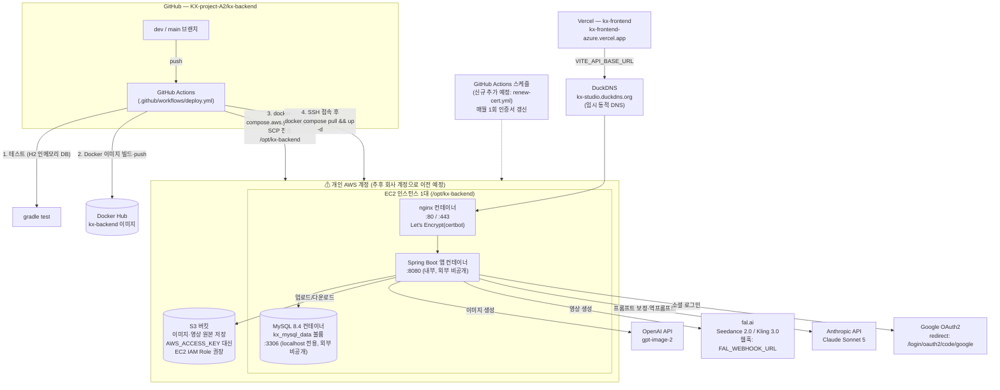
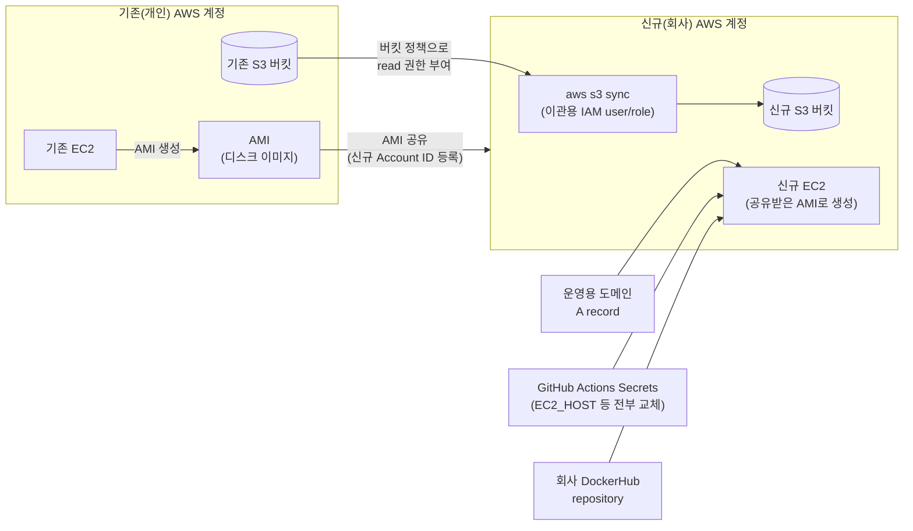

# BE 인프라 구조도

> 작성일: 2026-08-02 | 갱신: 2026-08-03 — BE가 제공한 `2026-08-03_BE_배포_및_인프라_이관_절차서.md` 기준으로 확정 반영
> `kx-backend` GitHub 저장소(dev 브랜치) 소스코드로 1차 재구성한 뒤, BE 절차서로 세부 사항(IAM Role 권장, 인증서 자동 갱신, 백업 주기 등)을 확정했다.
> ⚠ **현재 AWS 리소스(EC2·S3)는 담당자 개인 AWS 계정에 연결돼 있으며, 추후 회사 AWS 계정으로 이전 예정.** 아래 구조는 "지금" 기준이고, 이관 절차는 하단 2번째 다이어그램 참고.
> 관련 문서: `2026-08-03_BE_배포_및_인프라_이관_절차서.md`(원본, 상세 절차는 이 문서가 기준), `2026-08-02_FE_배포_인수인계_공유사항.md`

---

## 1. 현재 배포 구조

---

## 2. 개인 계정 → 회사 계정 이관 흐름 (BE 절차서 15장 기준)

**이관 핵심 요약 (BE 절차서 기준)**
- EC2는 새로 설치하는 게 아니라 **AMI(디스크 이미지)를 신규 계정에 공유해서 그대로 복제**하는 방식
- S3는 **신규 버킷을 만들고 `aws s3 sync`로 데이터 복사** — 과도기에는 기존 버킷에 신규 계정 read 권한만 임시로 부여
- **MySQL은 자동 이관 스크립트가 없고, `mysqldump` 백업 후 신규 서버에서 복구**하는 수동 절차 (최소 주 1회 백업 권장)
- HTTPS 인증서 자동 갱신은 현재 없음 → 신규 GitHub Actions 워크플로(`renew-cert.yml`, 매월 1회 cron) 추가로 해결 예정
- 상세 단계별 명령어·체크리스트는 `2026-08-03_BE_배포_및_인프라_이관_절차서.md` 3~15장 참고

---

## 3. 구조 요약 (현재 기준)

| 레이어 | 내용 |
|------|------|
| 소스·CI/CD | GitHub(`kx-backend`) → GitHub Actions → Docker Hub → EC2 SSH 배포. AWS CodePipeline/CodeDeploy 같은 AWS 네이티브 CI 도구는 쓰지 않음 |
| 컴퓨트 | EC2 1대, 개인 AWS 계정 소유. 오토스케일링·로드밸런서 없음(단일 인스턴스), 배포 디렉토리 `/opt/kx-backend` |
| 컨테이너 구성 | 같은 EC2 안에서 nginx·Spring Boot 앱·MySQL 3개 컨테이너가 docker-compose로 함께 실행 |
| DB | 관리형 서비스(RDS)가 아니라 EC2 위 컨테이너 MySQL — EC2와 생명주기 완전히 묶여 있음. 백업은 `mysqldump` 수동 실행, 주 1회 권장 |
| 파일 저장 | S3, 버킷도 개인 계정 소유. 접근은 액세스 키보다 **EC2 IAM Role 권장**(BE 절차서 명시) |
| 도메인 | DuckDNS 무료 동적 DNS, AWS Route53 아님. 운영 전환 시 정식 도메인 A 레코드를 신규 EC2(가급적 Elastic IP)로 연결 |
| 이미지 레지스트리 | Docker Hub — AWS 계정과 무관하게 그대로 재사용 가능한 유일한 조각(회사 계정 하에 repository만 새로 준비) |
| 외부 AI 연동 | OpenAI(이미지), fal.ai(영상, 웹훅 URL이 API 도메인에 의존), Anthropic(프롬프트 보정·역프롬프트) — 전부 AWS와 무관한 SaaS API, AWS 계정 전환 영향 없으나 API 도메인 변경 시 fal 웹훅 URL은 갱신 필요 |
| HTTPS | Let's Encrypt(certbot), 90일 만료. 자동 갱신 워크플로는 이관 작업 중 신규 추가 예정 |

**개인 계정 → 회사 계정 전환 시 새로 만들어야 하는 것**: EC2(AMI 공유 방식으로 복제), S3 버킷(신규 생성+데이터 동기화), IAM 자격증명, GitHub Actions Secrets 전체, Google OAuth Client(신규 프로젝트 기준 재발급), 외부 AI API 키(회사 계정 기준 재발급). **AWS 계정과 무관해서 그대로 유지 가능한 것**: GitHub 저장소, Docker Hub 이미지(계정만 교체), 외부 AI API 자체 연동 로직.
