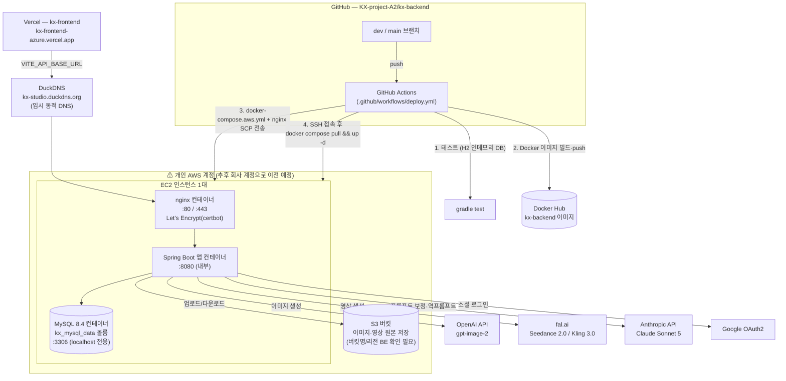

# BE 인프라 구조도

> 작성일: 2026-08-02 | `kx-backend` GitHub 저장소(dev 브랜치) 소스코드(GitHub Actions, docker-compose, nginx, application.yaml)만으로 재구성한 현재 배포 구조도.
> ⚠ **현재 AWS 리소스(EC2·S3)는 담당자 개인 AWS 계정에 연결돼 있으며, 추후 회사 AWS 계정으로 이전 예정** — 아래 구조는 "지금" 기준이고, 계정 전환 시 EC2·IAM 자격증명 등은 새로 발급된다.
> 관련 문서: `2026-08-02_BE_배포_인수인계_공유사항_초안.md`, `2026-08-02_FE_배포_인수인계_공유사항.md`

---

---

## 구조 요약 (현재 기준)

| 레이어 | 내용 |
|------|------|
| 소스·CI/CD | GitHub(`kx-backend`) → GitHub Actions → Docker Hub → EC2 SSH 배포. AWS CodePipeline/CodeDeploy 같은 AWS 네이티브 CI 도구는 쓰지 않음 |
| 컴퓨트 | EC2 1대, 개인 AWS 계정 소유. 오토스케일링·로드밸런서 없음(단일 인스턴스) |
| 컨테이너 구성 | 같은 EC2 안에서 nginx·Spring Boot 앱·MySQL 3개 컨테이너가 docker-compose로 함께 실행 |
| DB | 관리형 서비스(RDS)가 아니라 EC2 위 컨테이너 MySQL — EC2와 생명주기 완전히 묶여 있음 |
| 파일 저장 | S3 (버킷도 개인 계정 소유로 추정 — 회사 계정 전환 시 그대로 옮길지 새로 만들지 결정 필요) |
| 도메인 | DuckDNS 무료 동적 DNS, AWS Route53 아님 |
| 이미지 레지스트리 | Docker Hub — AWS 계정과 무관하게 그대로 재사용 가능한 유일한 조각 |
| 외부 AI 연동 | OpenAI(이미지), fal.ai(영상), Anthropic(프롬프트 보정·역프롬프트) — 전부 AWS와 무관한 SaaS API, 계정 전환 영향 없음 |

**개인 계정 → 회사 계정 전환 시 사실상 새로 만들어야 하는 것**: EC2 인스턴스, IAM 자격증명(액세스 키), S3 버킷(또는 데이터 이관), GitHub Actions Secrets 전체(`EC2_HOST`/`EC2_SSH_KEY`/`AWS_ACCESS_KEY_ID` 등). **AWS 계정과 무관해서 그대로 유지 가능한 것**: GitHub 저장소, Docker Hub 이미지, 도메인(DuckDNS 유지 시), 외부 AI API 키.
