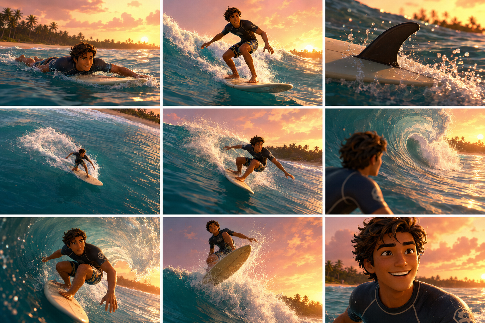
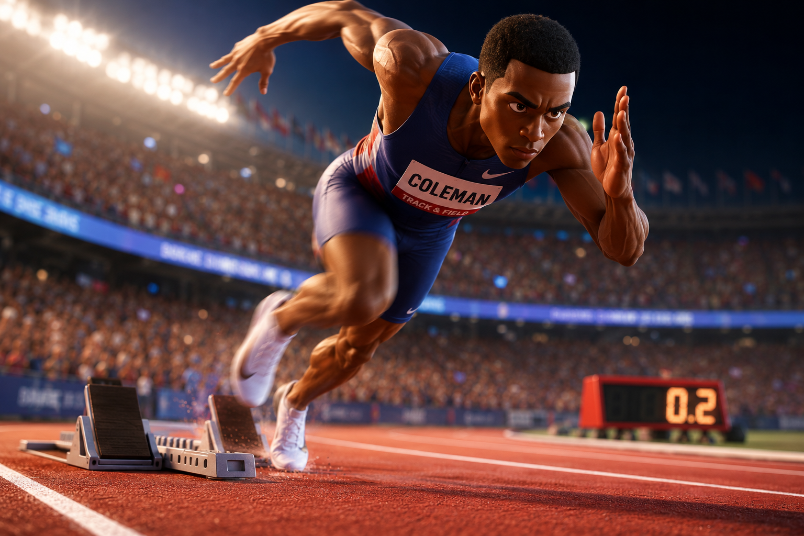
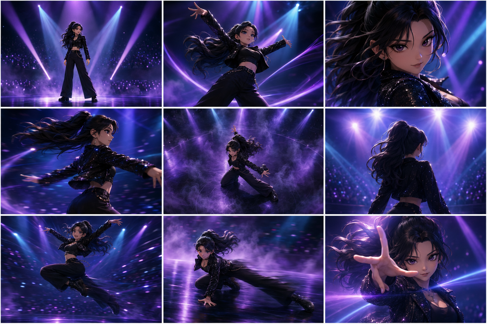
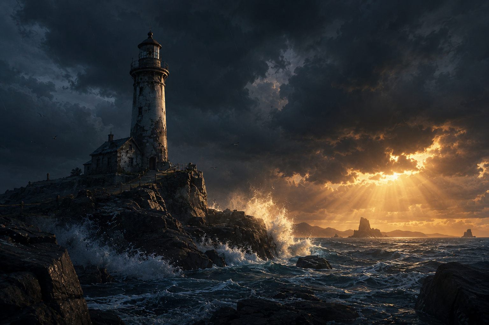

# 발표 당일 현장용 프롬프트 v3

## ■ 설계 원칙

- 전부 신규 오리지널 캐릭터·장면 (기존 프롬프트·PD님 캐릭터와 무관)
- 둘 다 "역동적"이되, 현장용은 한 인물·한 공간 안에서의 역동성으로 제한해 라이브 생성 리스크(다중 인물·다중 장소 전환 시 일관성 붕괴 위험)를 낮춤
- 전체 톤은 실사가 아닌 3D 애니메이션(Pixar/DreamWorks류 3D CGI) 스타일로 통일. 2D 셀셰이딩·망가풍 스피드라인 대신, 3D 렌더링 특유의 부드러운 라이팅·모션 스미어(motion smear)·과장된 포즈로 역동성을 표현
- **A 세트 캐릭터를 완전히 교체**: 스케이트보더 "이하람" → 서퍼 "정다온". 활동·배경·캐릭터 전부 새로 설계해 B 세트(댄서 "서리아")와도 확실히 겹치지 않도록 함. 스토리보드는 아직 생성 전이라 이 버전부터 그리드 프롬프트를 다시 싣는다.

---

## A. 서퍼 "정다온"

### 1) 한국어 자연어 프롬프트 — 캐릭터(다각도) + 배경(단일 이미지)

**캐릭터**

> "그을린 피부에 헝클어진 웨이브 헤어를 한 20대 남자 서퍼 캐릭터, 밝고 여유로운 인상. 반팔 래시가드에 보드쇼츠를 입고 서프보드를 옆구리에 낀 모습. 3D 애니메이션 캐릭터 느낌으로, 배경은 흰색으로 심플하게."

**배경**

> "파도가 부서지는 열대 해변, 야자수 실루엣이 있는 해질녘 하늘 아래 따뜻한 조명이 비치는 느낌으로. 3D 애니메이션 영화 같은 스타일로."

### 2) 3x3 스토리보드 이미지 + 프롬프트 — 서핑 라이딩 시퀀스

(손 클로즈업 없음 — 얼굴·보드·물보라 위주로만 구성)

**실제 생성 결과 — 서퍼 "정다온" 3x3 스토리보드**



**그리드 이미지 프롬프트 (GPT Image 2)**

```
A single image containing a 3x3 grid layout of 9 storyboard panels, thin white
borders separating panels. The panels form one continuous story sequence read
left to right, then top to bottom — the top-left panel is the story's opening
moment, the bottom-right panel is its closing moment, with the narrative
unfolding progressively across the grid. The image contains absolutely no
numbers, digits, readable text, or logos anywhere — the panels are visually
silent, distinguished only by their content and camera framing. No panel
contains a close-up of hands or fingers — focus close-ups on the face, the
surfboard, or the water spray instead.

Background first: a tropical beach break with rolling turquoise waves, a
distant palm-lined shoreline silhouette, warm sunset lighting, rendered in a
3D animated feature film style (Pixar/DreamWorks-like CGI), soft global
illumination, stylized rounded environment, warm orange-pink palette. The
same wave and shoreline silhouette must appear consistently across every
panel that shows it.

Character: 정다온, a tanned young man in his 20s with tousled wavy hair and
an easygoing, sunny expression, wearing a short-sleeve rash guard and board
shorts, designed as a stylized 3D animated character with smooth CGI shading
and slightly exaggerated proportions. His face shape, hairstyle, and outfit
must remain extremely consistent across all 9 panels — do not alter his
design between panels. His hands are never shown in close-up in any panel.

Top-left panel (story opens): wide establishing shot, 정다온 paddling out on
his board through incoming waves, chest low on the board.
Top-center panel: low angle shot, 정다온 popping up to a standing stance as a
wave crest rises behind him.
Top-right panel: close-up on the surfboard fin cutting through water, spray
kicking up, no hands in frame.
Middle-left panel: high angle shot looking down as he carves across the open
face of the wave, water spray trailing behind the board.
Center panel: wide tracking shot, 정다온 crouched low mid-wave, one arm
extended for balance, spray arcing behind him.
Middle-right panel: over-the-shoulder shot, the curling wave face opening up
into a barrel ahead of him.
Bottom-left panel: dutch angle shot, 정다온 riding inside the barrel of the
wave, motion smear and water droplets around him.
Bottom-center panel: low angle shot, 정다온 kicking out over the back of the
collapsing wave, a burst of spray and foam.
Bottom-right panel (story closes): close-up on his face, exhilarated grin,
warm sunset light and ocean behind him.

3D animated feature film style, Pixar/DreamWorks-like CGI rendering, smooth
shading, high detail.
```

**영상 Shot 프롬프트 (Seedance 2.0, 15초)**

```
Style: 3D animated feature film style (Pixar/DreamWorks-like CGI), soft global
illumination, warm orange-pink color grade, fast dynamic camera language,
quick cuts. No hand or finger close-ups in any shot.
Duration: 15s.

[00-01.5s] Shot 1: Paddle Out (Wide, Fast Tracking) — 정다온 paddles through
incoming waves. Sound: water splashing, wind.
[01.5-03s] Shot 2: Standing Ride (Low Angle, Quick Pan) — already up and
riding down the open wave face, board angled forward, arms out for balance.
Sound: sharp exhale, board thud.
[03-04.5s] Shot 3: Fin Spray (Close-up on Board, Snap Zoom) — fin cutting
through water. Sound: water slicing, spray hiss.
[04.5-06s] Shot 4: Carving (High Angle, Quick Pan Down) — cutting across the
wave face. Sound: rushing water.
[06-07.5s] Shot 5: Mid-Wave Crouch (Wide Tracking). Sound: wave roar.
[07.5-09s] Shot 6: Barrel Approach (Over-the-Shoulder, Fast Push-in) — the
wave curling into a barrel ahead. Sound: heartbeat thump, water rushing.
[09-11s] Shot 7: Inside the Barrel (Dutch Angle, Motion Blur) — riding
through the curl. Sound: muffled roar, water swirling.
[11-13s] Shot 8: Lip Trick (Low Angle, Impact Spray) — board angled
near-vertical near the wave's breaking lip, balancing through the trick as
spray bursts around him. Sound: sharp spray hiss, board scrape.
[13-15s] Shot 9: Exhilarated Grin (Close-up, Slow Push-in). Sound: satisfied
exhale fading into ambient ocean and wind.
```

### 3) 역프롬프트 추출용 이미지 프롬프트 (역동적인 다른 장르 — 스포츠 액션)

서핑과는 다른 장르로 역프롬프트 추출 테스트. 기존에 사용하던 스프린터 이미지를 그대로 사용한다.

**실제 사용 이미지 — 스프린터**



**생성 프롬프트 (GPT Image 2, 참고용)**

```
a professional sprinter bursting out of the starting blocks on a red track,
motion blur on the legs, low angle dynamic shot, stadium lights and blurred
crowd in the background, 3D animated feature film style, Pixar/DreamWorks-like
CGI rendering, high-energy sports broadcast composition, high detail
```

추출 시 예상 태그(6개): 스타일=3D 애니메이션 / 조명=스타디움 조명 / 구도=로우앵글 다이나믹 / 렌즈=모션 블러 / 색감=하이콘트라스트 / 분위기=긴장감·스피드감

---

## B. 퍼포먼스 댄서 "서리아"

> A와 무관한 별개 캐릭터. 인물 1명·무대 1곳 안에서의 역동성으로 제한해 라이브 생성 안정성 확보 (다중 장소 전환 없음).

### 1) 한국어 자연어 프롬프트 — 캐릭터(다각도) + 배경(단일 이미지)

**캐릭터**

> "웨이브 진 긴 흑발을 하나로 묶은 20대 여성 퍼포먼스 댄서 캐릭터, 반짝이는 블랙 크롭 재킷과 와이드 팬츠 입은 모습. 3D 애니메이션 캐릭터 느낌으로, 배경은 흰색으로 심플하게."

**배경**

> "보라와 시안 스포트라이트가 교차하는 화려한 콘서트 무대 배경, 안개 효과와 함께 조명이 비치는 느낌으로. 3D 애니메이션 영화 같은 스타일로."

### 2) 3x3 스토리보드 이미지 — 무대 위 퍼포먼스 하이라이트

**실제 생성 결과 — 퍼포먼스 댄서 "서리아" 3x3 스토리보드**



**영상 Shot 프롬프트 (Seedance 2.0, 15초)**

```
Style: 3D animated feature film style (Pixar/DreamWorks-like CGI), soft
volumetric lighting, purple-cyan spotlight beams, haze/fog, dynamic but
single-location camera language (stage only).
Duration: 15s.

[00-02s] Shot 1: Center Stage (Wide, Static Hold) — spotlight hits 서리아.
Sound: rising synth swell.
[02-03s] Shot 2: Power Pose (Low Angle, Snap Zoom). Sound: bass hit.
[03-04.5s] Shot 3: Face Close-up (Extreme Close-up, Whip Pan). Sound: sharp
inhale.
[04.5-06s] Shot 4: Spin (Side Profile, Motion Blur Pan). Sound: fabric
whoosh.
[06-08s] Shot 5: Low Stance Drop (High Angle, Slow Zoom-in) — fog swirls.
Sound: bass drop.
[08-09.5s] Shot 6: Silhouette (Over-the-Shoulder, Static). Sound: crowd cheer
swell.
[09.5-11s] Shot 7: Mid-Leap (Low Angle, Fast Tracking). Sound: rhythmic beat
hit.
[11-13s] Shot 8: Floor Slide (Wide Tracking) — knee slide across stage.
Sound: fabric slide, cheering.
[13-15s] Shot 9: Final Pose (Close-up, Slow Push-in) — spotlight flare.
Sound: music swelling to a peak, crowd roar.
```

### 3) 역프롬프트 추출용 이미지 — 라이브 리스크 최소화를 위한 두 가지 옵션

**옵션 (등대 배경)**



```
an abandoned lighthouse standing on a rocky coastline during a storm,
dramatic storm clouds rolling overhead, crashing waves with sea spray
catching a shaft of golden light breaking through the clouds, wide cinematic
establishing shot, deep blue-grey palette with a warm amber highlight on the
horizon, moody atmospheric tone, no characters, 3D animated feature film
style, Pixar/DreamWorks-like CGI rendering, high detail
```

추출 예상 태그(6개): 스타일=3D 애니메이션 풍경 / 조명=구름 사이 빛줄기 / 구도=와이드 설정샷 / 렌즈=광각 / 색감=블루그레이+앰버 하이라이트 / 분위기=웅장함·비장함

---

## ■ 리허설 체크리스트

- [ ] A 세트: 새 캐릭터(정다온) 캐릭터·배경·3x3 스토리보드 이미지 순서로 실제 생성해 녹화, 그리드 번호 미노출·인물 일관성(모션 스미어 구간, 3D 캐릭터 디자인 유지) 확인
- [ ] B 세트: 발표 전날 최소 1회 동일 환경에서 리허설 실행 (성공 확인, 다이나믹한 포즈에서도 3D 캐릭터 디자인 붕괴 없는지 특히 체크)
- [ ] B-3 옵션 이미지는 3D 애니메이션 스타일로 새로 생성해 발표 당일 업로드 폴더에 미리 복사해두기 (기존 실사 이미지로 대체하지 말 것)
- [ ] 라이브 중 실패 시 백업으로 A 세트 녹화 영상 즉시 재생 가능하도록 준비
